## Motores de render: de archivos a píxeles

Los 5 pasos de los motores:

Pasa los archivos de HTML a objetos (El DOM). Esto para que el navegador pueda entenderlo.
Calcula el estilo correspondiente a cada nodo en el DOM.
Calcula las dimensiones de cada nodo y va a empezar a estructurar la página web.
Pinta las diferentes cajas.
Toma las capas y las convierte en una imagen, para finalmente mostrar esta imagen en la pantalla.

## ¿Qué es HTML semántico?

El HTML semántico consiste en que cada elemento tenga su propia etiqueta que lo defina correctamente. Sin utilizar etiquetas muy generales, como <div> o <span>.

El problema con la etiqueta div
La etiqueta div define un bloque genérico de contenido, que no tiene ningún valor semántico. Se utiliza para elementos de diseño como contenedores.

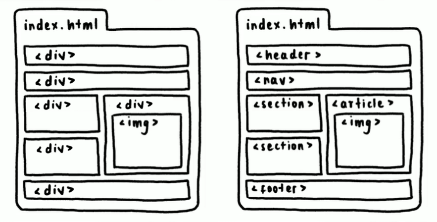

¿Cuáles son las etiquetas semánticas?
Las etiquetas semánticas para definir una interfaz de una página web son:

- <header>: define el encabezado de la página (no confundir con <head>).
- <nav>: define una barra de navegación que incluye enlaces.
- <section>: define una sección de la página.
- <footer>: define un pie de página o de sección.
- <article>: define un artículo, el cual puede tener su propio encabezado, navegación, sección o pie de página.

Ahora que ya conoces las etiquetas semánticas, evita el uso excesivo de <div>.

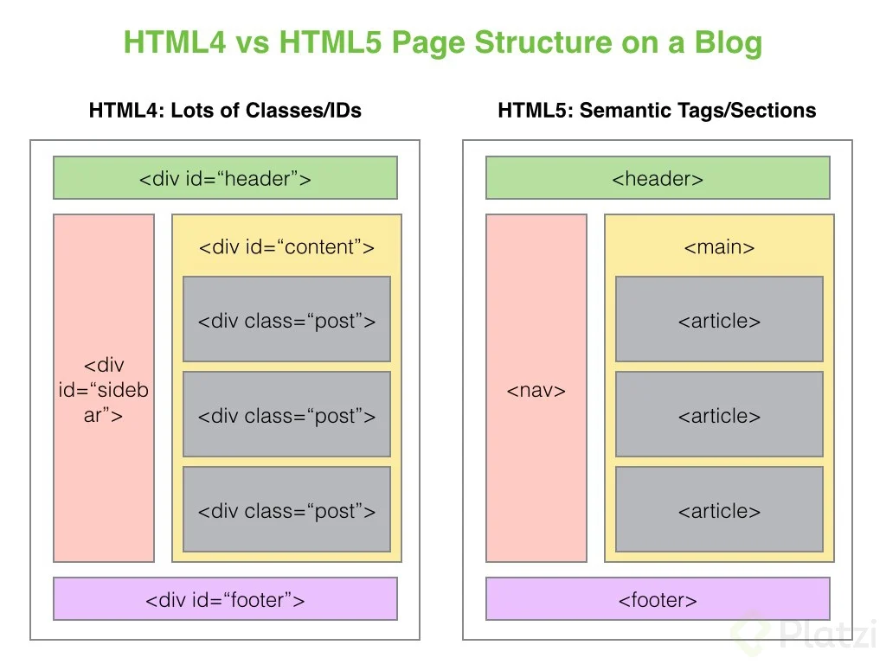

Ventajas de utilizar HTML semántico
Las ventajas de utilizar un HTML semántico son:

- Ayuda a tu sitio a ser accesible
- Mejora tu posicionamiento (SEO)
- Código más claro, legible y mantenible
- Ayuda a buscadores (como Google) a encontrar tu página

## Anatomía de una declaración CSS: selectores, propiedades y valores

### Selector

Es el medio que no comunica entre el HTML y el CSS, con él podemos decir que etiqueta, clase o id queremos estilizar.

Dentro de las llaves, que va seguido del selector, va todo nuestro código de CSS.

### Propiedad

Hay muchos tipos y es el tipo o clase de estilos que queremos aplicar.

### Valor

Es el valor que queremos que tenga nuestra propiedad.

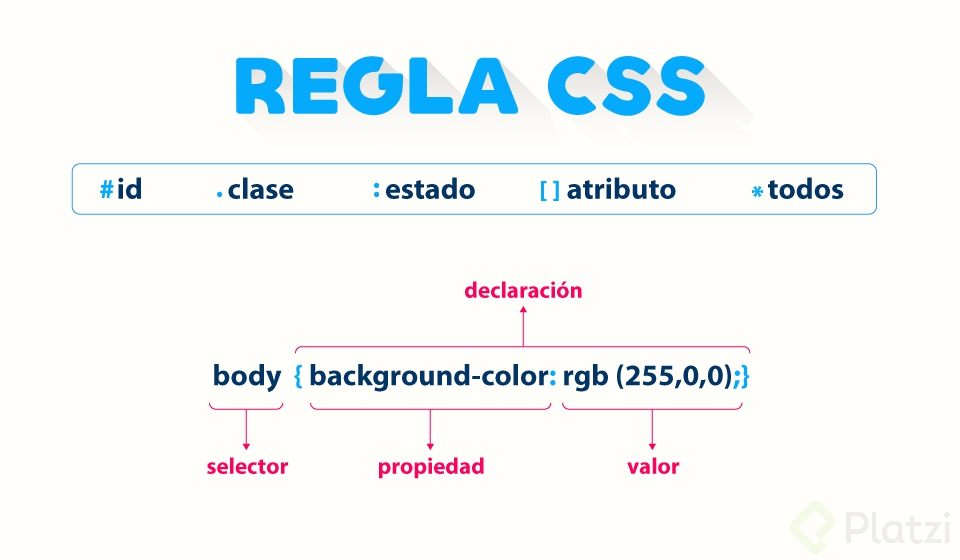

## Tipos de selectores: básicos y combinadores

### Básicos

- De tipo: `div {...}`
- De clase: `.elemento {...}`
- De id: `#id {...}`
- De atributo: `a[href="..."] {...}`
- universal: `* {...}`

### Combinadores

- Descendientes: `div p`
- Hijo directo: `div > p`
- Elemento adyacente: `div + p`
- General de hermanos: `div ~ p`

## Tipos de selectores: pseudoclases y pseudoelementos

Las **pseudoclases** nos permite llegar a aquellas acciones que hace el usuario.

- `:active`
- `:focus`
- `:hover`
- `:nth-child(n)`

Los **pseudoelementos** nos permiten acceder a elementos de HTML que no son accesibles con los selectores ya vistos.

- `::after`
- `::before`
- `::first-letter`
- `::placeholder`

## Cascada y especificidad en CSS

### Qué es la cascada en CSS?

La cascada es el concepto que determina qué estilos se colocan sobre otros, priorizando a aquellos que se encuentren más abajo del código. Recordarás que CSS es la abreviación de Cascade Style Sheets, que traducido es hojas de estilos en Cascada.

### Qué es especificidad en CSS?

La especificidad consiste en dar un valor a una regla CSS sobre qué tan específico es el estilo, esto para que los navegadores puedan saber qué estilos aplicar sobre otros, independientemente de dónde se encuentren en el código. El estilo se aplicará donde la especificidad sea mayor.

### Tipos de especificidad en CSS

Existen 6 tipos de especificidad con su respectivo valor, donde X es la cantidad de estilos que lo contienen. Mira la siguiente imagen:

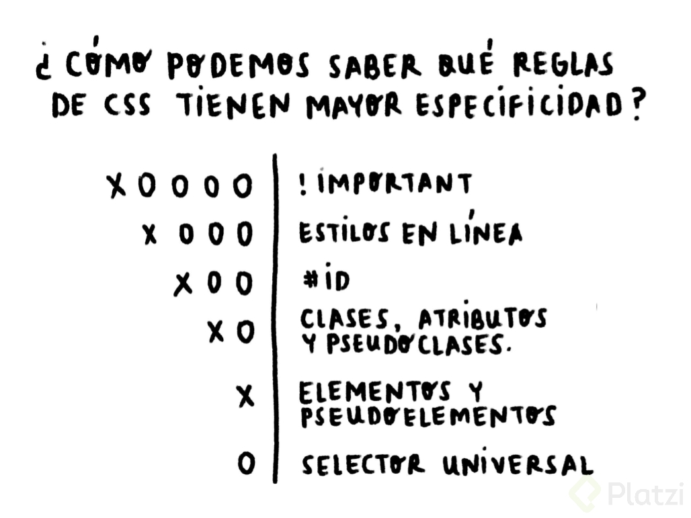

### Especificidad en selectores

El tema de los selectores ya lo conoces, por lo tanto, los selectores de tipo ID son más específicos que las clases, atributos y pseudoclases. Estas últimas son más específicas que los elementos y pseudoelementos. El selector universal tiene una especificidad de 0.

En un proyecto deberías evitar los !important y estilos en línea, para trabajar únicamente con la especificidad de los selectores. Sin embargo, debes tener presente que los selectores combinadores suman la especificidad de cada selector básico para obtener la especificidad total de la regla CSS.

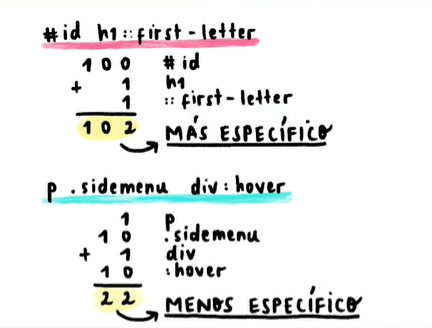

## Tipos de display más usados: block, inline e inline-block

- inline: Estos elementos son los que su caja mide exactamente lo mismo que su contenido. Estos elementos los podemos usar en textos y en lugar de que se agreguen en una nueva línea se agregaran justo al ladito del texto. ❗ Tienen como desventaja que no podemos ponerles márgenes ni tampoco podemos cambiar su tamaño.

- block: Estos elementos ocupan toda la pantalla, por lo que si quieres agregar otro elemento, este se agregará automáticamente abajo. No importa que tengas poco contenido, el elemento sí o sí va a ocupar toda la pantalla.

- inline-block: Esto mezcla lo mejor de ambos mundos. Con este display podemos tener tanto los beneficios de inline como de block, es decir, podemos tener elementos que no ocupen todo el ancho de la pantalla, sino que ocupen solamente lo que su contenido ocupa, pero también vamos a poder darle márgenes y podremos cambiar su tamaño 🤠.

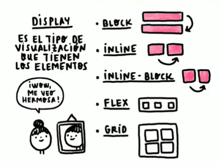

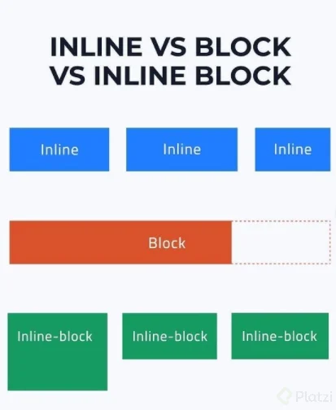

- Visualización nula (none)

El display none desactiva la visualización de un elemento, como si el elemento no existiera.

## Tipos de display más usados: flexbox y CSS grid

El display **flex** y **grid** son formas de visualización de elementos recientes y cada uno tienen sus propias características para crear interfaces de manera efectiva, a partir de un contenedor padre que dotará a los elementos hijos de superpoderes del posicionamiento.

Ambas son herramientas muy útiles en el desarrollo, especialmente para la creación de interfaces amigables al usuario y aptas para cualquier dispositivo, que este último se lo conoce como responsive design.

Sin embargo, ambas herramientas tienen temas muy extensos de entender, y como mi intención no es estresarte con demasiada información, simplemente ten presente de manera general en qué consisten.

### Qué es flexbox

Flexbox consiste en el ordenamiento de elementos hijos en un solo eje, por defecto horizontalmente. El elemento padre o contenedor deberá contener la propiedad display con el valor flex. A partir de aquí, ya puedes ordenar los hijos según sea necesario.

### Qué es grid

Grid consiste en el ordenamiento de elementos hijos en dos ejes, como si fuera una cuadrícula o tabla. El elemento padre o contenedor deberá contener la propiedad display con el valor grid y debes definir las medidas de las columnas y de las filas. A partir de aquí, ya puedes ordenar los hijos según sea necesario.

## Modelo de caja

El modelo de caja se compone de cuatro elementos: **margin, border, padding y contenido**.

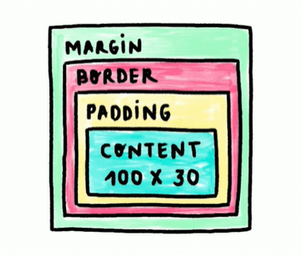

### Qué es el contenido del elemento HTML

El contenido del elemento, como su nombre lo indica, es todo lo que está dentro del elemento. Este tiene medidas establecidas por las propiedades width y height, que representan la anchura y la altura, respectivamente. Si imaginamos una caja, este valor sería todo lo que decidas colocar dentro.

```
div {
  width: 100px;
  height: 100px;
}
```

### Qué son los bordes del elemento HTML

El border consiste en el perfil o borde de un elemento HTML. Si imaginamos una caja, sería la caja en sí. Para definir un borde es necesario utilizar las siguientes tres propiedades:

- border-color: establece el color del borde.
- border-style: establece el estilo propio del borde, estos pueden ser: none (sin borde), dotted (puntos), dashed (guiones), solid (continuo), double (doble continuo), groove (recuadro).
- border-width: estable la anchura del borde.

```
div {
  border: [color] [style] [width];
}

div {
  border-color: red;
  border-style: solid;
  border-width: 1px;
}
```

También estableciendo de manera individual los valores de cada posición:

```
div {
  border-top: 5px solid blue;
  border-bottom: 5px solid red;
  border-left: 5px solid black;
  border-right: 5px solid yellow;
}
```

### Qué es el espaciado interno del elemento HTML o padding

El padding consiste en el espacio entre el borde y el contenido del elemento HTML. Si imaginamos una caja, este valor sería el espacio entre la caja y lo que deseas guardar.

```
div {
  padding: 100px;
}
```

Puedes establecer el padding en cada posición en una sola línea de las siguientes maneras:

- padding: [arriba] [derecha] [abajo] [izquierda], siguiendo el sentido horario.
- padding: [arriba] [abajo] [derecha e izquierda], siguiendo el eje principal.
- padding: [arriba y abajo] [derecha e izquierda], siguiendo los ejes del elemento.

También estableciendo de manera individual los valores de cada posición:

```
div {
  padding-top: 10px;
  padding-bottom: 15px;
  padding-left: 20px;
  padding-right: 10px;
}
```

### Qué es el espaciado externo del elemento HTML o margin

El margin consiste en el espacio entre el borde y otro elemento HTML. Si imaginamos una caja, es el espacio entre tu caja y otra caja.

```
div {
  margin: 10px;
}
```

Puedes establecer el margin en cada posición en una sola línea de las siguientes maneras:

- margin: [arriba] [derecha] [abajo] [izquierda], siguiendo el sentido horario.
- margin: [arriba] [abajo] [derecha e izquierda], siguiendo el eje principal.
- margin: [arriba y abajo] [derecha e izquierda], siguiendo los ejes del elemento.
  También estableciendo de manera individual los valores de cada posición:

```
div {
  margin-top: 10px;
  margin-bottom: 15px;
  margin-left: 20px;
  margin-right: 10px;
}
```

### Qué son los valores por defecto

Por defecto, el navegador establece valores iniciales a algunas propiedades CSS, este es el caso de margin y padding. Una buena práctica es utilizar el selector universal para restablecer estos valores a 0, para que no surjan errores inesperados.

```
* {
  margin: 0;
  padding: 0;
}
```

### Qué es el tamaño total del elemento

El tamaño total del elemento está determinado por la suma de los valores de las propiedades border padding y widtho height, dependiendo del eje. La propiedad margin no está incluida en este cálculo.

Por ejemplo, definimos los siguientes estilos:

```
div{
  width: 150px;
  height: 150px;
  padding: 20px;
  border: 10px solid gray;
  margin: 30px;
}
```

El tamaño total del elemento será de 210px en ambos ejes, donde la suma fue: 150 (altura/anchura) + 20 x 2 (padding ambos lados) + 10 x 2 (borde ambos lados). Si evaluamos este elemento en las herramientas del desarrollador mostrará su tamaño como 210x210.

## Colapso de márgenes

El colapso de márgenes sucede cuando dos elementos bloque adyacentes tienen un determinado valor de margin, entonces estos márgenes se solapan en un solo valor, el mayor de ambos.

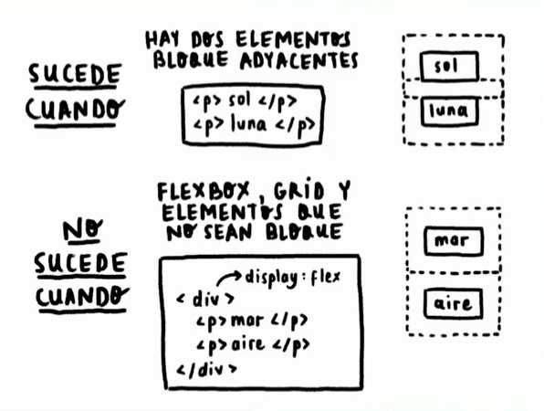

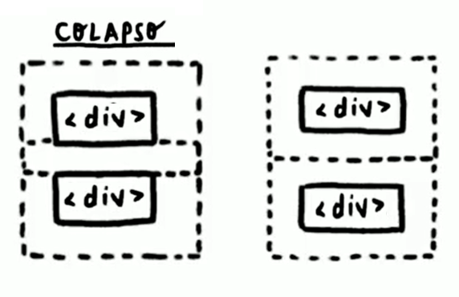

## Ejempplo de colapso de margenes

```
div{
  display: inline-block;
  margin: 40px;
  background-color: greenyellow;
  width: 80%;
  height: 50px;
  padding: 10px;
}
```

El div por defecto es block y los margenes no colapsan, pero si al cambiarlo a **inline-block**

### Explicación de colapso de márgenes

Como puedes observar, al cambiar el display este comportamiento desaparece. Además, en **flexbox y grid** no ocurre el colapso de márgenes. Cuida los márgenes que colocas en los elementos de tipo bloque.

## Posicionamiento en CSS

El posicionamiento en CSS consiste en cómo un elemento se situará, **con respecto a su elemento padre y al flujo normal del documento**. El flujo normal del documento es el orden de los elementos establecidos en el HTML.

La posición del elemento se la define con la propiedad position, mediante los siguientes valores:

- Absolute
- Relative
- Fixed
- Sticky
- Static
- Initial
- Inherit

Todos estos nos van a dar un comportamiento diferente por cada una de las etiquetas. Las podemos agregar a todas las etiquetas y nos van a dar el mismo comportamiento pero los vamos a utilizar para diferentes cosas.

### Static

Utilizamos este valor no vamos a tener ningún cambio porque todas las etiquetas vienen con este valor.

Cuando estamos en este position no podemos utilizar las propiedades left, top, right y bottom.

### Relative

El elemento mantiene su lugar, pero podemos posicionarlo donde queramos.

Lo podemos usar como contenedor para que los elementos que tengan un position absolute tomen como referencia al padre que nosotros queremos (se adhiere al elemento relativo más cercano) y no a otro, delimita el movimiento del hijo.

### Absolute

Con absolute el elemento sale de su lugar y el navegador reacomoda los elementos, poniendo otro elemento en el lugar del elemento con position absolute. Podemos posicionar al elemento como queramos dentro del elemento padre.

### Fixed

Este valor de position nos permite que el elemento que queramos nos siga a todos lados desde el momento en el que nos topemos con él.

### Sticky

Es similar a fixed con la diferencia que cuando encuentra a otro elemento con su mismo position, sticky, le da lugar a ese elemento.

### Initial

Vuelve el position de un elemento a como estaba originalmente.

### Inherit

Lo usamos si queremos que nuestro elemento herede el position de su padre.

### Left, top, right y bottom

Con estas cuatro propiedades podemos mover a los elementos que tengan como position a absolute, relative fixed o sticky a los lugares que queramos.

## Z-index y el contexto de apilamiento

El contexto de apilamiento consiste en la superposición de capas o elementos a lo largo del eje Z del navegador. Esto es importante para evitar que un elemento esté ocultando a otro.


### Qué son los planos y ejes

El navegador está constituido de tres planos y ejes: el ancho o X; el alto o Y; y el de profundidad o Z.

El eje X positivo está hacia la derecha; el eje Y positivo está hacia abajo; y el eje Z positivo está hacia el usuario.

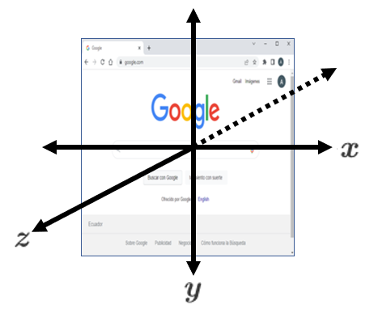

Estos son muy importantes para mover los elementos del HTML desde un punto inicial hacia un punto final.

### Qué es la propiedad z-index

El contexto de apilamiento se configura con la propiedad z-index.

Por defecto, todos los elementos tienen un valor auto, es decir, el orden está definido por la estructura del HTML. Los primeros elementos estarán detrás y los últimos estarán de frente.

Si se establece un valor positivo, este elemento se sitúa por delante de los demás. Si se establece un valor negativo, se sitúa por detrás.

Si un elemento tiene un z-index mayor a otro, estará por delante. Sin embargo, si un elemento que tiene un z-index menor a otros, sus hijos nunca estarán por encima, aunque su z-index sea mayor.

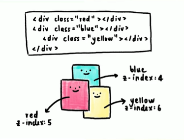

Como puedes observar en la imagen, el elemento con la clase yellow tiene un z-index mayor a red, pero no está por encima, porque su contexto de apilamiento está dentro del contexto de apilamiento del elemento blue, así mismo, nunca estará por detrás de su elemento padre.

Básicamente son capas que hay una encima de la otra, entonces a medida que vas poniendo más y más estas se van apilando.

Esto sucede cuando empezamos a hacer uso de position y es ahí en donde entra en juego la propiedad z-index, básicamente porque ahora estamos trabajando en el eje Z. El eje Z es el que va desde la pantalla hacia ti.

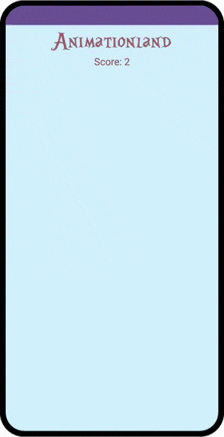

## Propiedades y valores de CSS más usados

Las propiedades CSS más usadas son las siguientes, separadas en secciones comunes, algunas ya las conocemos:

- Display
- Margin
- Padding
- Border
- Width
- Height
- Color
- Background

### Propiedades de textos

Las propiedades para manipular los textos y tipografía son los siguientes:

- font-size: establece un tamaño de fuente.
- font-weight: establece el resaltado del texto, con valores de 100 a 900 en intervalos de 100; donde 100 es delgada y 900 es negrita.
- font-family: establece el tipo de fuente.
- text-align: establece la posición del texto: right, left, center y justify.
- color: establece el color del texto.

### Bordes redondeados

La propiedad que establece bordes redondeados es: border-radius.

## Unidades de medida

Las unidades de medida establecen una longitud para un determinado elemento o tipografía. Existen dos tipos de medidas: absolutas y relativas.

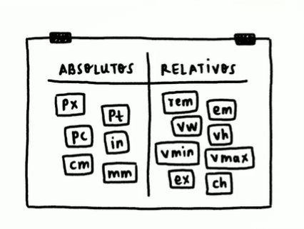

### Qué son las medidas absolutas

Las medidas absolutas son valores fijos, por lo que la medida no cambiará. La unidad absoluta más utilizada son los píxeles px, las demás son muy poco utilizadas, pero es bueno que las conozcas.

- px: píxeles
- cm: centímetros
- mm: milímetros
- Q: cuartos de milímetro
- in: pulgadas
- pc: picas
- pt: puntos

### Qué son las medidas relativas

Las medidas relativas son valores variables, por lo que la medida depende de un valor externo. Se debe tener en cuidado con estas porque un pequeño cambio puede desencadenar tamaños muy elevados.

- em: el elemento que lo contiene
- rem: el elemento raíz
- vw: 1% del ancho de la pantalla (view width)
- vh: 1% de la altura de la pantalla (view height)
- vmin: 1% de la dimensión más pequeña de la pantalla
- vman: 1% de la dimensión más grande de la pantalla
- ch: anchura del caracter “0” del elemento que lo contiene
- lh: altura de la línea del elemento que lo contiene

### Diferencia entre rem y em

La medida em depende del elemento que lo contiene, es decir, si un elemento tiene font-size de 20px, el valor de em es igual a 20px, el valor de 2em será de 40px y así sucesivamente.

La medida rem depende del elemento raíz, el valor del font-size del elemento raíz es de 16px, por lo tanto, el valor de 2rem es igual a 32px, y así sucesivamente.

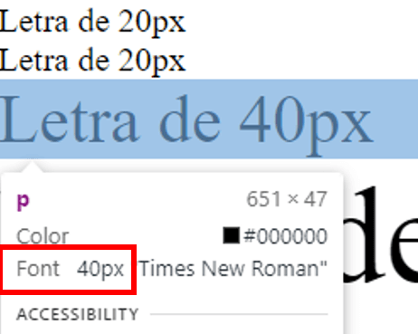

### Diferencia entre porcentajes y la anchura y altura de la pantalla

Los porcentajes representan el tamaño con respecto al total del elemento padre. Si el elemento padre tiene 20px, entonces el 100% será de 20px.

Por otra parte, las medidas de anchura vw y altura vh representan el tamaño con respecto al total de la pantalla. Si el elemento tiene un tamaño de 100vw será el 100 por ciento de la pantalla.

Si un elemento tiene todo el tamaño de la pantalla, entonces solamente en ese punto la medida 100% será igual a 100vw o 100vh.

### Problema con las medidas de texto

Los navegadores tienen una opción para cambiar el tamaño del texto. Con medidas absolutas, el tamaño de la letra no cambiará, por lo que será un problema para el usuario.

Con medidas relativas, el tamaño cambiará con respecto a la fuente del elemento raíz. Por lo que estas son una buena opción para solucionar este problema de accesibilidad, en específico la medida rem.

Sin embargo, la medida rem equivale a 16px y puede ser confuso mientras utilices valores altos. Por lo que vamos a cambiar el valor del elemento de la raíz para que la medida rem sea igual a 10px.

En la etiqueta <html> cambia el valor de la propiedad font-size a 62.5%, resultado de una regla de tres: si 16px es igual al 100% entonces cuál será el porcentaje para 10px.

```
html {
  font-size: 62.5%;
}
```

Con este cambio, la medida rem será igual a 10px, ahora los puedes utilizar sin problema y tus textos cambiarán según las preferencias de usuario.

## ¿Para qué es responsive design?

Es para que nuestro proyecto web pueda ser multiplataforma, que se pueda ver bien en un smartphone, desde una tablet, iPad y que se vean excelente desde una laptop o computadora de escritorio.

### Media Queries

Con los media queries podemos jugar con el layout, cuando la pantalla del dispositivo sea pequeña el contenido se ve de una forma, pero si está pantalla crece el contenido también lo hace sin perjudicar el diseño.

Podemos cambiar la orientación de los contenedores, podemos cambiar su orden, incluso cambiar las dimensiones.

#### Estos son dos tipos de media querie :

- max-width / max-height: establece un rango máximo para cierto comportamiento.
- min-width / min-height: establece un rango mínimo para cierto comportamiento.
  Estos valores son parecidos a condicionales, mientras se cumpla la condición, aplica determinados estilos.

Estructura de la media querie
La estructura de una media querie consiste en empezar con @media, seguido del tipo de la media querie estableciendo un rango, envolviendo las reglas CSS dentro de ese rango.

#### Breakpoint

Son la dimensión en el viewport, es decir el width y el height de la pantalla, en donde vamos a generar un cambio.

Este cambio es la forma en la que puedo reposicionar ciertos elementos o redimensionar ciertos contenedores, todo esto para que se vea bien la web app y sin importar el dispositivo en el que se abra.

#### min-width

Esto quiere decir que cuando la pantalla sea igual o más grande que el valor que coloquemos, el código que esté adentro del media querie se va a ejecutar.

Pero si la pantalla es mayor a ese min-width habrá otro media querie que aplicará estilos diferentes.

#### max-width

Esto quiere decir que cuando la pantalla sea igual o más pequeña que el valor que coloquemos, el código que esté adentro del media querie se va a ejecutar.

- La mejor forma de aplicar media queries tiene de nombre **Mobile First** o **Mobile Only**.

Esto quiere decir que el proyecto ya debe estar diseñado para dispositivos mobile, ya no debemos preocuparnos por que se vea bien desde una laptop o computadora de escritorio.

El diseño del proyecto va a partir desde un dispositivo mobile y desde ahí va a ir creciendo a los demás dispositivos con mayor pantalla.

Si hacemos lo contrario de ir de una pantalla grande a una más pequeña, esto se llama solamente responsive design y no es lo que estamos buscando.

#### Aplicado directo desde CSS con media queries

- Arriba de los media queries vamos a tener el código base, que es el que está hecho y optimizado para dispositivos mobile.
- Vamos a generar un breakpoint para realizar ciertos cambios en dispositivos más grandes.
- Vamos a generar otro breakpoint que va a ser para una tablet o para computadoras con un viewport más pequeño como ser netbooks
- Luego vamos a generar otro breakpoint que será para computadoras de escritorio, desktop o dispositivos con pantallas más grandes.

##### Orden para aplicar los media queries

Partimos desde los dispositivos más pequeños y terminamos con los dispositivos más grandes.

Si lo hacemos de forma inversa tendremos problemas, ya que como CSS funciona en cascada, nunca se van a aplicar los estilos de los medias queries con un viewport más grande.

Empezamos por:

- Los celulares o dispositivos mobile.
- Las tablets.
- Laptops o computadores de escritorio.

#### Aplicado directo desde HTML (la mejor practica)

Este método se utiliza, ya que dependiendo del dispositivo donde esté el usuario va a necesitar un archivo CSS u otro, esto es para evitar que carguen archivos que el usuario no va a necesitar ni usar.

Lo agregamos en el head, aquí en vez de ligar un archivo de CSS vamos a ligar más de uno, dependiendo de los dispositivos en los que queramos aplicar los estilos.

```
<link rel="stylesheet" href="style.css">
```

Si tenemos archivos CSS que van a impactar en otros dispositivos con diferente viewport

```
<link rel="stylesheet" href="tablet.css" media="screen and (min-width: 768px)">
<link rel="stylesheet" href="desktop.css" media="screen and (min-width: 1024px)">
```

Agregamos el atributo media cuyo valores va a ser el mínimo que necesitamos para hacer ese breakpoint, que es ese cambio en el layout.

Orden final:

```
<link rel="stylesheet" href="style.css"> <!-- Los dispositiivos mobiles -->
<link rel="stylesheet" href="tablet.css" media="screen and (min-width: 768px)">
<link rel="stylesheet" href="desktop.css" media="screen and (min-width: 1024px)">
```

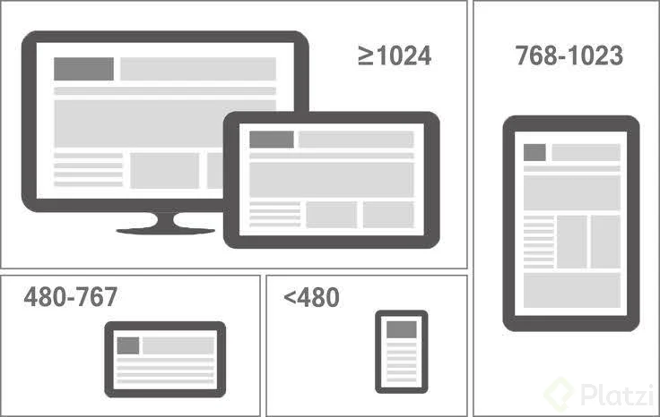

## ¿Qué son y para qué nos sirven las arquitecturas CSS?

Sirven para mantener un orden y una coherencia durante todo el proyecto. Tiene los siguientes objetivos:

- Predecibles: el código debe ser lo menos complejo posible.
- Reutilizable: el código debe ser lo menos redundante, para evitar problemas con la especificidad.
- Mantenible: el código debe ser lo más fácil de manejar para añadir o quitar estilos.
- Escalable: el código debe ser capaz de crecer.

Estos objetivos se deben ver reflejadas en buenas practicas que debe conocer todo el equipo involucrado en el proyecto como:

- Lineamientos y estándares: definir normas en tu grupo de trabajo de cómo estará escrito el código.
- Documentación: establecer una breve explicación del código y de los lineamientos, esto sirve especialmente para nuevas personas se familiaricen con lo que deben hacer.
- Componentes: establecer de manera componetizada cada uno de los elementos de tu página, es decir, manejarlos por partes para después unirlos en un todo.

## OOCSS, BEM, SMACSS, ITCSS y Atomic Design

### Qué es CSS orientado a objetos

La arquitectura OOCSS (Object Oriented CSS) consiste en separar la estructura principal y la piel o máscara.

En otras palabras, consiste en tener objetos que son estructuras principales. Estos objetos estarán unidos en una máscara, donde esta será la que cambie pero manteniendo la estructura intacta.

### Qué es BEM: bloque, elemento y modificador

La arquitectura BEM (Block-Element-Modifier) es una de las más utilizadas actualmente. Consiste en manejar los elementos en clases definidas por bloques, elementos y modificadores.

- Bloque: es la estructura principal que es contenedora de varios elementos.
- Elemento: es el elemento HTML que hace referencia el contenedor.
- Modificador: es un estilo específico para el elemento. Por ejemplo, un botón que tenga un color diferente a los demás, esto tiene relación con la especificidad.

### Qué es la arquitectura escalable y modular de CSS

La arquitectura SMACSS (Scalable and Modular Architecture for CSS) indica el orden de componentes que estarán ubicados en carpetas. La unión de estos componentes dará como resultado tu página web con estilos.

- Base: elementos base, como botones, títulos, enlaces.
- Layout: estructura de la página, relacionado con el Responsive Design.
- Módulos: elementos que contienen a los elementos base.
- Estado: estilos relacionados con el comportamiento de elemento, relacionado con las pseudoclases y pseudoelementos.
- Temas: conjunto de estilos que definen tu página web.

### Qué es el triángulo invertido de CSS

La arquitectura ITCSS (Inverted Triangle CSS) consiste en separar los archivos del proyecto; mediante ajustes, herramientas, elementos, entre otros. Todo esto para manejar los detalles de especificidad, claridad y magnitud.

### Qué es el diseño atómico

La arquitectura Atomic Design también es una de las más utilizadas actualmente. Consiste en manejar los elementos como una estructura mínima, a partir de la unión de varias de estas, dará como resultado los estilos de la página web. Se basa en la estructura mínima de la materia, los átomos.

- Átomos: estructura mínima; como botones, enlaces, títulos, entre otros.
- Moléculas: unión de átomos.
- Organismos: unión de moléculas.
- Plantillas: unión de organismos.
- Páginas: unión de plantillas.

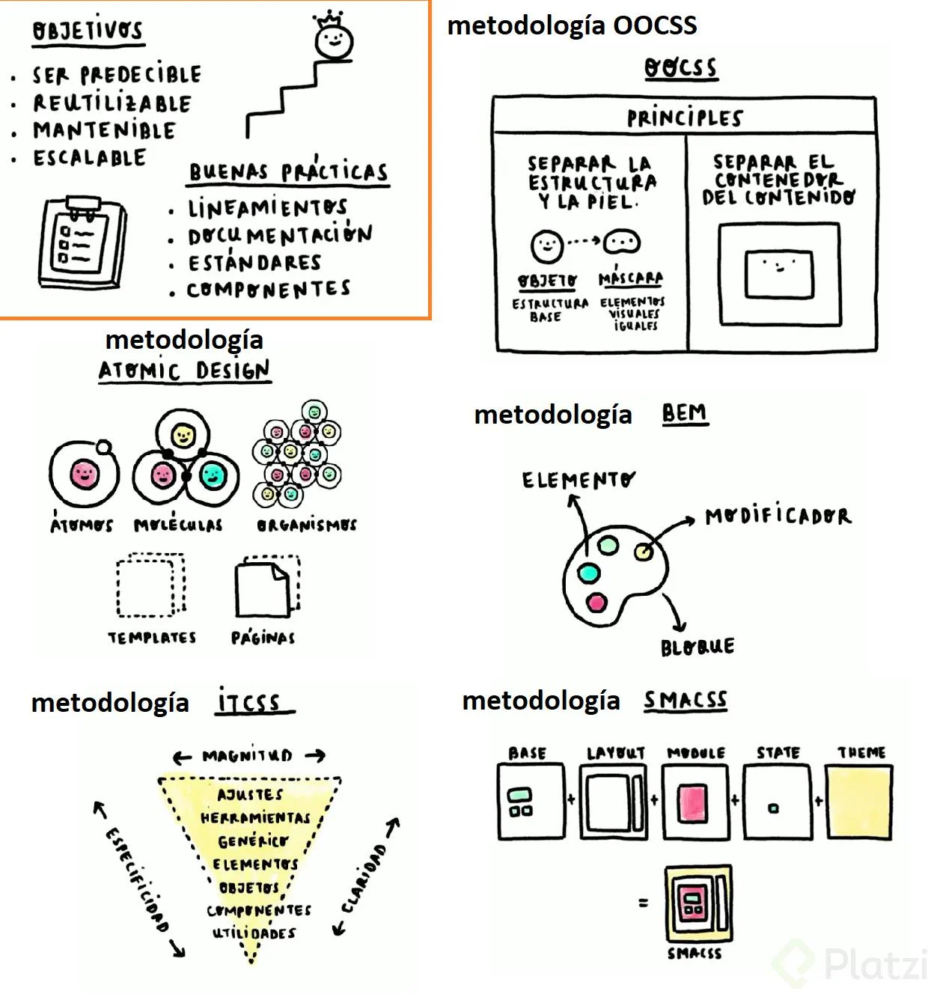

### Recursos

- HTML, CSS, JS en la web: https://codi.link/%7C%7C

#### Para prácticar maquetado

- PlatziWeb Challenge: https://platzi.com/blog/platzi_web_challenge/
- Frontend Mentor: https://www.frontendmentor.io/
- Coderbyte: https://coderbyte.com/challenges
- Codewell: https://www.codewell.cc/challenges

#### Para reforzar habilidades

- CSS Battle: https://cssbattle.dev/
- Codepen.io: https://codepen.io/

- CSS Reference: https://cssreference.io/
- Flexbox: https://css-tricks.com/snippets/css/a-guide-to-flexbox/
- Grid: https://css-tricks.com/snippets/css/complete-guide-grid/
- Responsive Design: https://web.dev/learn/design/
- Entrevistas https://github.com/learning-zone/css-interview-questions
