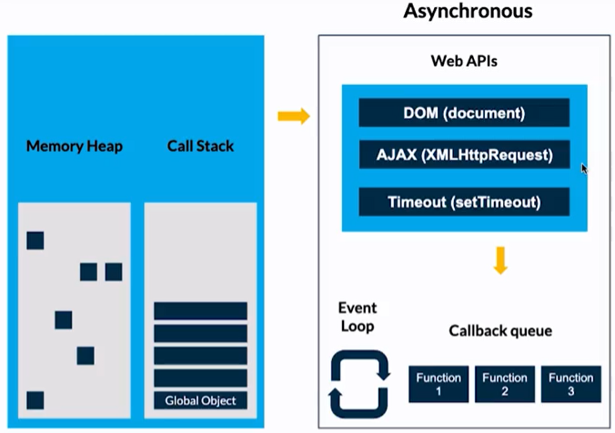

# Clase #2: Qué es el asincronismo

- La asincronía de JavaScript consiste en delegar algunas tareas para que las ejecute el navegador, una vez esas tareas están terminadas entran en otra estructura llamada Callback queue. En el Callback queue la primera tarea que entra, es la primera en salir. ¿Cómo salen? Mediante el Event Loop.

- El Event loop es el encargado de preguntar al Call Stack si ya ha terminado todas sus tareas. Entonces, si y solo si el Call Stack está vacío, el Event loop moverá las funciones que están en el Callback queue para que se ejecuten.

- Para entender mejor este término, tomemos el ejemplo de los tacos, pero ahora tienes un compañero. Entonces tú delegas la tarea de preparar la torta a otra persona, mientras realizas los tacos.

- Luego de 5 minutos por cada tarea, entregas las tortas a los clientes correspondientes. Después de 10 minutos necesitas la torta, entonces preguntas ¿ya está lista la torta? Tu ayudante te entrega la torta y se lo entregas. En total fueron 20 minutos y todos los clientes recibieron su pedido. Así funciona la asincronía en JavaScript.

- Asincronía en JavaScript
El proceso completo que sigue JavaScript se muestra en la siguiente imagen: 

- Las Web APIs son herramientas adicionales que te ofrece el navegador para realizar peticiones, modificar el DOM, entre otras. Estas herramientas las puedes observar en el objeto global window.

- Ejemplo de asincronía
Rápidamente, la función asíncrona setTimeout consiste en ejecutar otra función en cierto tiempo. Recibe dos valores, la función a establecer un retraso y el tiempo en milisegundos.

Observa el siguiente código y piensa cuál será el resultado:

```
const foo = () => console.log("First");
const bar = () => setTimeout(() => console.log("Second"), 0);
const baz = () => console.log("Third");

bar();
foo();
baz();
```

- Primero se muestra en consola "First".
- Segundo se muestra en consola "Third".
- Después de medio segundo, "Second".

Esto es porque la función bar salió del Call Stack para esperar asíncronamente un tiempo definido (0 segundos en este caso). Después tendrá que esperar (sin importar el tiempo establecido en setTimeout) hasta que se vacíe el Call Stack para que el Event loop le permita entrar nuevamente al Call Stack para ejecutarse.


https://dev.to/lydiahallie/javascript-visualized-event-loop-3dif


- 🌮 call stack : el taquero (órdenes rápidas)
- 👨‍🍳 web APIs : la cocina
- 🌯 callback queue : las órdenes preparadas
- 💁‍♂️ event loop : el mesero

## ✍🏾 Conceptos importantes para entender el asincronismo:

- 🧵 Thread: Thread para Javascript permite realizar programación multihilos en este entorno. En realidad, simula la creación y ejecución de hilos, pero para el desarrollador es lo mismo. Ésto simplifica muchísimo la creación de aplicaciones Javascript. 
- 🚫 Bloqueante: Una llamada u operación bloqueante no devuelve el control a la aplicación hasta que se ha completado. Por tanto el thread queda bloqueado en estado de espera.
- 🚿 No bloqueante: Una tarea no bloqueante se devuelve inmediatamente con independencia del resultado. Si se completó, devuelve los datos. Si no, un error.
- 🎞️ Síncrono: Las tareas se ejecutan de forma secuencial, se debe esperar a que se complete para continuar con la siguiente tarea.
- 🚦 Asíncrono: Las tareas pueden ser realizadas más tarde, lo que hace posible que una respuesta sea procesada en diferido. La finalización de la operación I/O (entrada/salida) se señaliza más tarde, mediante un mecanismo específico como por ejemplo un callback, una promesa o un evento, lo que hace posible que la respuesta sea procesada en diferido.
- 🛤️ Paralelismo: El paralelismo es la ejecución simultánea de dos o más tareas. Algunas tareas se pueden dividir en partes más pequeñas que pueden ser resueltas simultáneamente.
- 🎮 Concurrencia: La concurrencia es la capacidad de un algoritmo o programa para ejecutar más de una tarea a la vez. El concepto es similar al procesamiento paralelo, pero con la posibilidad de que muchos trabajos independientes hagan diferentes cosas a la vez en lugar de ejecutar el mismo trabajo.
- 🌀 Eventloop o Loop de eventos: El bucle de eventos es un patrón de diseño que espera y distribuye eventos o mensajes en un programa.
---

## 📝 Formas de manejar la asincronía en JavaScript:

- 📩 Callbacks: Una función que se pasa como argumento de otra función y que será invocada.
- 🗃️ Promesas: (implementado en ES6) Una promesa es una función no-bloqueante y asíncrona la cual puede retornar un valor ahora, en el futuro o nunca.
- 🛣️ Async / Await: (implementado en ES2017) Permite estructurar una función asincrónica sin bloqueo de una manera similar a una función sincrónica ordinaria.
- 📌 En JavaScript casi todas las operaciones de I/O (Entrada y Salida) no se bloquean. A esto se le conoce como asíncronismo. Lo único que no es procesado antes de que termine la operación son los callbacks, ya que éstos están amarrados a una operación y esperan a que sea finalizada para poder ejecutarse.
- ⏳ El asincronismo es una manera de aprovechar el tiempo y los recursos de la aplicación, ejecutando tareas y procesos mientras otros son resueltos en background (como la llegada de la información de una API), para posteriormente continuar con las tareas que requerían esa información que no tenías de manera instantánea.
- ⏲️ Un ejemplo fácil de asincronismo vs sincronismo es invitar a unos amigos a una fiesta y ofrecer una parrillada. Primero decides colocar la carne y verduras a la parrilla y luego repartir bebidas y algo para picar (snacks). Si fuera una persona síncrona (Blocking) tendrías que esperar a que la comida de la parrilla esté cocinada y luego atender a los invitados. Pero si fuera una persona asíncrona (Non Blocking) luego de poner la carne al carbón, sacas las bebidas frías de la nevera y compartes con los invitados mientras se cocina la carne. La acción de que la comida en la parrillada esté lista sería un callback que está esperando que finalice el proceso para ejecutarse. Pero otros procesos (como compartir la velada con bebidas y algo de picar) ya podrían irse realizando.
---
<br>

# Clase #3: Estructuras de datos

## Javascript se organiza usando las siguientes estructuras de datos:

- 🗃️ Memory Heap: Región de memoria libre de gran tamaño, dedicada al alojamiento dinámico de objetos (asignado a un montículo). Es compartida por todo el programa y controlada por un recolector de basura que se encarga de liberar aquello que no se necesita, es decir de forma desorganizada se guarda información de las variables y del scope.
- 🔋 Call Stack (pila LIFO: Last-in, First-out): Apila de forma organizada las instrucciones de nuestro programa. La pila de llamadas, se encarga de albergar las instrucciones que deben ejecutarse. Nos indica en que punto del programa estamos, por donde vamos.
- 🚗🚕🚙 Task Queue (cola): Cada vez que nuestro programa recibe una notificación del exterior o de otro contexto distinto al de la aplicación, el mensaje se inserta en una cola de mensajes pendientes y se registra su callback correspondiente. El stack debe estar vacío para que esto suceda.
- 🚗🚕 Micro Task Queue: Aquí se agregan las promesas. Esta Queue es la que tiene mayor prioridad.

- Demostracion: https://bit.ly/3JT9Mhr

---

## Iniciar proyecto
- Web APIs JavaScript del lado del cliente: setTimeout, XMLHttpRequest, File Reader, DOM. Node: fs, https.
- API: El término API es una abreviatura de “Application Programming Interface” (Interfaz de programación de aplicaciones en español). Es un conjunto de rutinas que provee acceso a funciones de un determinado software.
Hoisting: Sugiere que las declaraciones de variables y funciones son físicamente movidas al comienzo del código en tiempo de compilación.
- XML: Lenguaje de marcado creado para la transferencia de información, legible tanto para seres humanos como para aplicaciones informáticas, y basado en una sencillez extrema y una rígida sintaxis. Así como el HTML estaba basado y era un subconjunto de SGML, la reformulación del primero bajo la sintaxis de XML dio lugar al XHTML; XHTML es, por tanto, un subconjunto de XML.
- DOM: El DOM permite acceder y manipular las páginas XHTML como si fueran documentos XML. De hecho, DOM se diseñó originalmente para manipular de forma sencilla los documentos XML.
- Events: Comportamientos del usuario que interactúa con una página que pueden detectarse para lanzar una acción, como por ejemplo que el usuario haga click en un elemento (onclick), que elija una opción de un desplegable (onselect), que pase el ratón sobre un objeto (onmouseover), etc.
- Compilar: Compilar es generar código ejecutable por una máquina, que puede ser física o abstracta como la máquina virtual de Java.
- Transpilar: Transpilar es generar a partir de código en un lenguaje código en otro lenguaje. Es decir, un programa produce otro programa en otro lenguaje cuyo comportamiento es el mismo que el original.

## Callbacks y Promesas

https://www.freecodecamp.org/espanol/news/funciones-callback-en-javascript-que-son-los-callback-en-js-y-como-usarlos/#:~:text=Los%20callbacks%20aseguran%20que%20una,salvo%20de%20problemas%20y%20errores.

https://fakeapi.platzi.com/

- Un callback devuelve una función en los parámetros, cuando llamamos varias veces un callback, estaremos colocando muchas lineas de código y sería engorroso, por eso nacen las promesas, éstas optimizan y permiten leer mejor el código con pocas lineas.

- Las promesas son asíncronas, por lo que el código continuará su ejecución normalmente y luego dirá si la promesa se resolvió o se rechazó. Por lo que varias promesas pueden llegar a entrar en ejecución al mismo tiempo.


https://developer.mozilla.org/en-US/docs/Glossary/CORS

---

## Async/Await

¿Qué es una función asíncrona?

- La declaración de función async define una función asíncrona que devuelve un objeto, lo cual permite a un programa correr una función sin congelar todo la compilación.
Dada que la finalidad de las funciones async/await es simplificar el comportamiento del uso síncrono de promesas, se hace más fácil escribir promesas.

- 🔏 La estructura se compone por las palabras reservadas async y await:

- La palabra async antes de la función, hace que la función devuelva una promesa.
- La palabra await se utiliza dentro de las funciones async, lo que hace que el programa espere hasta que la variable(promesa) se resuelva para continuar.


- async: https://developer.mozilla.org/es/docs/Web/JavaScript/Reference/Statements/async_function
- await: https://developer.mozilla.org/es/docs/Web/JavaScript/Referencia/Operadores/await

### Try/Catch

La palabra reservada try consiste en un bloque que contiene una o más sentencias, como hacíamos con resolve.
Su cuerpo está conformado por las llaves {} las cuales se deben utilizar siempre, incluso para un bloque de una sola sentencia.
También puede estar presente un bloque con la palabra reservada catch.
Un bloque catch es opcional (como hacíamos con reject) y contiene sentencias que especifican que hacer si una excepción es lanzada en el bloque try.
Si no se lanza ninguna excepción en el bloque try, el bloque catch se omite.

✏️ Ejemplo:
La estructura try / catch se asemeja a if / else, solo que catch puede detectar un error en caso de que haya uno:
```
const anotherFunction = async (url_api) => {
  try {
    // Our code here
  } catch (error) {
    console.log(error);
  }
}
```

## Generators

- Un generador en JavaScript consta de una función generadora que muestra un objeto iterable Generator. La palabra reservada yield se usa para pausar y reanudar una función generadora.

- La estructura del Generador consta con la palabra function seguido de un asterísco * : function* ésta es una función generadora heredada.
El resultado que se quiere obtener se coloca al lado derecho de yield, puede ser de cualquier tipo (string, numérico, objetos, etc) y se puede tener tantos yield que se desee.

https://developer.mozilla.org/es/docs/Web/JavaScript/Reference/Global_Objects/Generator


¿El método then() retorna?
Promesa
2.
¿Para qué nos sirve la clase XMLHttpRequest?
Nos permite realizar solicitudes HTTP de una forma muy fácil.
3.
¿Cuál es el método recomendado por la comunidad para manejar asincronismo en JavaScript?
Async/await
4.
Palabra que nos permite definir una función así­ncrona. Selecciona la opción correcta:
async
5.
¿Cuáles son los argumentos que recibe una promesa?
resolve, reject
6.
¿Para qué nos sirve el método "catch()"?
Registra la razón del rechazo.
7.
¿Para qué utilizamos JSON.parse(xhttp.responseText)?
Convertir una respuesta de texto en un Objecto iterable.
8.
¿Cuál es la forma correcta de retornar un Error en reject?
reject (new Error(Error))

9.
¿Nos permite ejecutar una serie de promesas secuencialmente?
Promise.all()

10.
¿Para qué nos sirve xhttp.status === 200?
Verificamos que el estatus de la petición HTTP resuelva el estado 200.

11.
¿Cuál es la expresión que pausa la ejecución de la función así­ncrona y espera la resolución de la promise?
await
12.
Es el problema de anidamiento de callbacks, que las promesas resuelven. Selecciona la respuesta correcta.

callback hell
13.
¿Cómo aseguramos manejar los errores asincrónicos correctamente?
try { ...código } catch (error) { ...código }

14.
Una función callback es:

Una función que se pasa a otra función como un argumento, invocada dentro de la función externa.