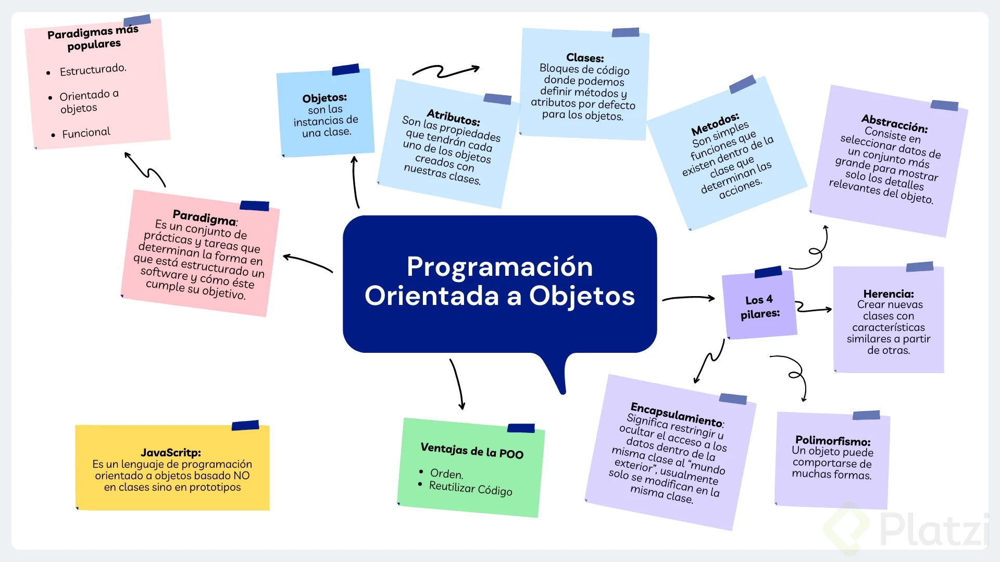

## Qué es programación orientada a objetos?

* Los prototipos son un mecanismo mediante el cual los objetos en JavaScript heredan características entre sí

### Paradigmas
Cuando programamos un algoritmo existen diferentes formas de llegar a un mismo resultado

Los paradigmas de programación formas, caminos, indicaciones o lineamientos que podemos seguir para programar nuestras aplicaciones.

### Existen muchos paradigmas entre los más llamativos son:
* Estructurado
* Orientado a objetos
* Funcional

Cada paradigma se creó para solucionar algunos problemas o dificultades que nos generaban los paradigmas que existían en el pasado.

Existen lenguajes que te permiten utilizar más de un paradigma como otros que son exclusivos para un paradigma de programación.

## Programación Orientada a Objetos

### 🔠 Orden
Uno de los primeros problemas a resolver fue el orden.

Esto nos ayuda cuando todos los elementos de nuestra aplicación están conectados entre sí.
Los objetos nos permiten definir:

* Atributos: son valores que serán propios de unos objetos. Ej: Natalia tiene una lista de cursos que desea tomar, para eso crea un **atributo** que lo llama cursos a tomar.
* Métodos: son comportamientos para nuestros objetos. Ej: Para agregar o eliminar un curso a la lista, crea uno o varios **métodos** para actualizar la lista.

### 🍪 Reutilizar
Imagínate crear varias galletas las cuales deban de tener un mismo tamaño y grosor, este proceso será repetitivo.

Al tener un molde será más sencillo crear las mismas de una misma forma
Crear moldes toma un poco más de tiempo, pero a largo plazo para crear uno nos ahorra mucho más tiempo.

En POO estos moldes se llaman clases, las cuales podremos reutilizar declarando atributos y métodos.

📌 **RESUMEN:** La programación orientada a objetos es un paradigma. Un paradigma es un conjunto de lineamientos o guías que nos ayuda a resolver un problema específico.

---




## Qué es un objeto en JavaScript

Aunque javascript es un lenguaje orientado a objetos no esta basado en clases como el resto de los lenguajes orientados a objetos, sino en prototipos.

### Objeto literal
* Los objetos literales se distinguen de los objetos de la POO porque no son instancias de un prototipo creado por el desarrollador.

* Sin embargo los objetos literales son instancias del prototipo Object creado por defecto en JavaScript.


```
const Natalia = {
	'Name' : 'Natalia',
	'Age' : 20,
	'Rank': 2000, 
};
```

### Prototipo
* Un prototipo es una estructura de código a partir de la cual se crean objetos, ya que guarda los atributos y métodos que luego podrán ser heredados por sus instancias.

* Podemos pensarlo como un “molde” de objetos.

```
function Student() {
	this.name = 'Nombre';
	this.age = '18';
	this.points = '750';
}

const Juanita = new Student();
```

### Objeto
* Los objetos son *estructuras de datos* formadas por **métodos** y **atributos**, los cuales hereda de su prototipo padre.

* De modo que los objetos son **instancias** de ese prototipo, particularmente cuando dicho prototipo fue creado por el desarrollador (en caso contrario se llaman objetos literales).

### Atributos

* Dentro de los objetos se pueden guardar atributos para guardar en ellos la información que se les asocia. Así, toda la información del objeto se guarda en sí mismo.

### Métodos

* Dentro de los objetos también pueden guardarse métodos, los cuales son funciones que, entre otras cosas, permiten actualizar la información guardada en los atributos de forma segura.

### Atributo **__proto\__**
* Es el nombre que se le da al atributo donde se guardan los métodos que las estructuras de datos tienen por defecto en JavaScript.

* El atributo __proto\_\_ se hereda a partir de los prototipos por defecto de JavaScript para cada estructura de datos en particular, por ejemplo de los prototipos Object y Array.

* El atributo __proto\_\_ también se hereda a los objetos, ya que éstos son a la vez instancias de algún prototipo creado por el desarrollador y del prototipo Object.


## Clases

Basicamente las clases hacen lo mismo que los prototipos pero con una sintaxis diferente, mas amigable para el programador.

El patrón “RORO” (“Receive an object, return an object”) nos ayuda cuando tenemos muchos parámetros en nuestro constructor, ya que al instanciar la clase debemos acordarnos del orden de los parámetros y, además, no podemos tener parámetros por defecto.

No obstante, si recibimos un objeto, sí podemos poner parámetros por defecto y no recibir un parámetros si fuere el caso, sin que pase nada.

A la hora de enviar los argumentos al instanciar la clase, también debe enviarse un objeto, y otra ventaja es que esos argumentos no hace falta que estén en el mismo orden que están los parámetros del constructor. ¡Prácticamente son todo ventajas! 😃


## Abstracción

La **abstracción** tiene como objetivo aislar las propiedades y funciones esenciales en una clase que sirve de molde para crear otros objetos (instancias) que comparten las mismas propiedades y funciones y se pueden personalizar.
Ventajas de uso:

* Evitamos codigo duplicado, es decir, reutilizamos codigo.
* Podemos crear múltiples instancias con una sola abstracción.
* Al encapsular datos, los estamos protegiendo
* Evitamos código a bajo nivel.
* Podemos cambiar implementaciones en la clase, sin perjudicar su funcionamiento.


## ¿Qué es encapsulamiento?

Es guardar, proteger o limitar el acceso de cierto atributos y/o propiedades en nuestros prototipos y objetos.

### Cuando hablamos de **encapsulamiento** hablamos de:

* Esconder métodos y atributos 👻
* No permitir la alteración de métodos y atributos ❌

### Formas de aplicar encapsulamiento en JavaScript

* Getters y setters 🖐
* Namespaces 🙂
* Object.defineProperties 🎈
* Módulo de ES6 🤝

## Herencia

La herencia nos permite crear nuevas clases a partir de otras, se basa en modelos y se genera una jerarquía de padre e hijo.

JavaScript en un lenguaje orientado a objetos basado en prototipos, en lugar de estar basado en clases. Debido a esta básica diferencia, es menos evidente entender cómo JavaScript nos permite crear herencia entre objetos, y heredar las propiedades y sus valores.

## Polimorfismo

Es como la herencia reloaded. Es como ‘La Herencia 2.0’. Permite a nuestras subclases cambiar o anular los comportamientos de los métodos y atributos del prototipo madre, de la clase madre. Aunque herede las propiedades, el polimorfismo permite cambiar su comportamiento.

### Tipos:

* Polimorfismo de Sobrecarga: ocurre cuando existen métodos con el mismo nombre y funcionalidad similar en clases totalmente independientes entre ellas.
* Polimorfismo Paramétrico: El polimorfismo paramétrico es la capacidad para definir varias funciones utilizando el mismo nombre, pero usando parámetros diferentes (nombre y/o tipo).
* Polimorfismo de Inclusión (JS): La habilidad para redefinir por completo el método de una superclase en una subclase.


