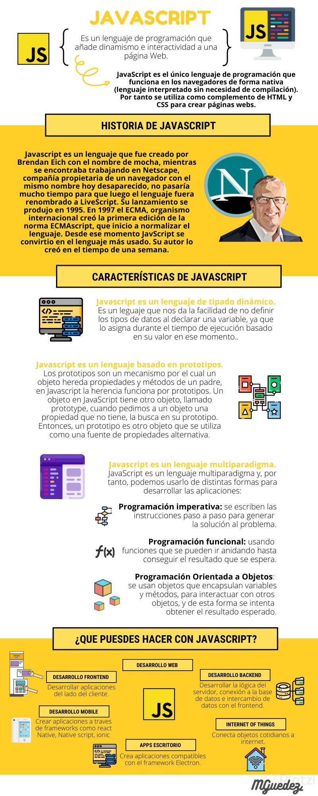
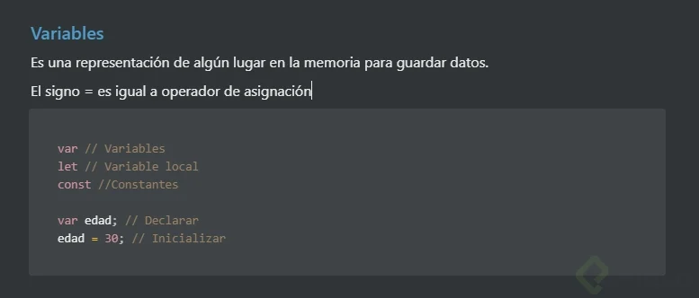
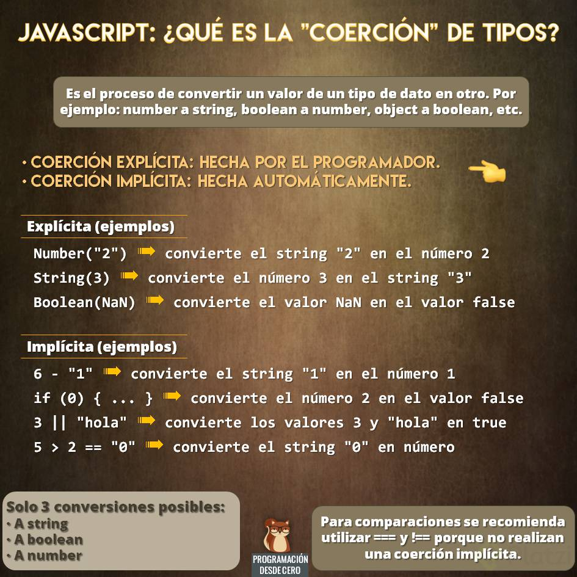
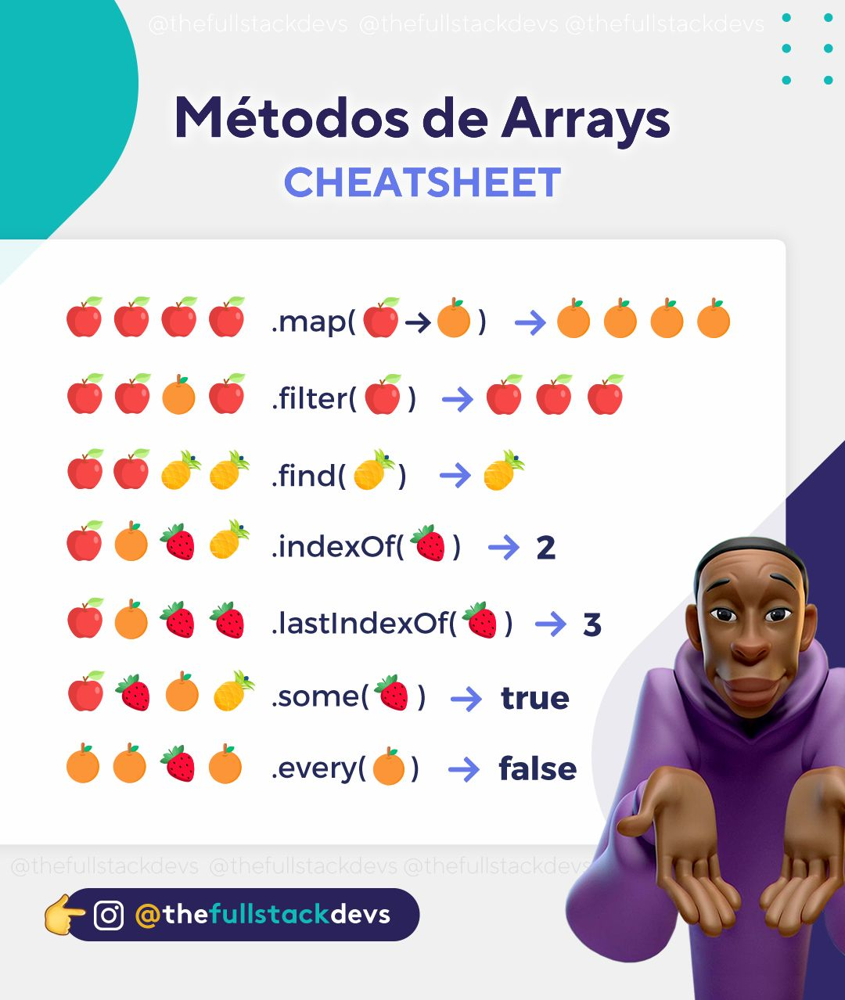
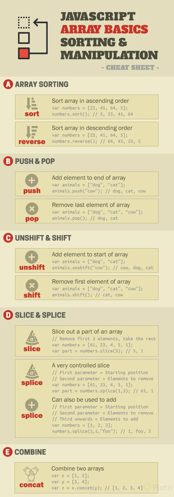

# Curso Básico de JavaScript

* Consola en el navegador: https://jsconsole.com/



## Variables



## Diferencia entre funciones declarativas y funciones de expresion

* La función declarativa se ve afectada por el hoisting, mientras que la expresiva no.
* El hoisting es utilizado para referirse a cómo funcionan los contextos de ejecución en JavaScript (específicamente las fases de creación y ejecución).
* Con las funciones declaradas, tenemos la seguridad de que siempre estarán disponibles en tiempo de ejecución.
* Con las funciones expresadas, tendremos que éstas no son evaluadas hasta que el intérprete no alcance su posición en el código, lo cual puede generar errores en arquitecturas muy anidadas.

---

## Scope:
* Global -> Universo , seria como el todo , las variables son accesibles desde cualquier parte del código.
* Local -> Cada Planeta , un mundo distinto , las variables son accesibles en ese mundo , no es visible para los demás mundos.

* Resumen: Lo que es global se puede acceder desde cualquier parte de tu código , y lo pueden acceder cada mundo , lo que es local solo lo puede acceder cada mundo

## Hoisting:

En JavaScript, las declaraciones se mueven al principio de su scope o ámbito. Este comportamiento se conoce como hoisting.
* Las funciones de tipo **function** siempre se mueven arriba del scope. Por lo tanto, podemos elegir donde declararlas y usarlas.
* La declaración de las variables **const y let** se mueven arriba del scope, pero no la asignación. Antes de usar una variable, habrá que crearla y asignarla.

---

## Coercion:

Coerción es la forma en la que podemos cambiar un tipo de valor a otro, existen dos tipos de coerción:
* Coerción implícita = es cuando el lenguaje nos ayuda a cambiar el tipo de valor.
* Coerción explicita = es cuando obligamos a que cambie el tipo de valor.



---

## ¿Que tipos por default son verdaderos y falsos?

### Falsy:
```
  Boolean()
  Boolean(0)
  Boolean(null)
  Boolean(NaN)
  Boolean(Undefined)
  Boolean(false)
  Boolean("")
```

### Truthy:
```
  Boolean(1)
  Boolean(“a”)
  Boolean(" ")
  Boolean([])
  Boolean({})
  Boolean(function() {})
  Boolean(true)
```

## Arrays

* Un Array es un tipo de estructura de datos (objeto). Puede guardar datos distintos dentro, guarda los datos en forma de lista. 
* Sus elementos principales son el indice y el elemento.
* Un array no es inmutable.





https://github.com/degranda/jsBasico-

## Bucles

Los bucles pueden ejecutar un bloque de código varias veces. JavaScript admite diferentes tipos de bucles:

* for - recorre un bloque de código varias veces.
* for/in - recorre las propiedades de un objeto.
* for/of - recorre los valores de un objeto iterable.
* while - recorre un bloque de código mientras se cumple una condición específica.
* do/while - también recorre un bloque de código mientras se cumple una condición específica.

#### for of / for in

El bucle **for of** recorre iterables, como arrays, Map o Set. El valor es cada elemento del iterable puede tener cualquier nombre, por eso se inicia con let nombre.

```
const array = [5, 4, 3, 2, 1]

for (let numero of array) {
  console.log(numero) // 5 4 3 2 1
}
```
Sin embargo, debes tener en cuenta que solo podrás acceder a sus valores, y no a sus referencias, por lo que si quieres cambiar los elementos del array, necesitarás un índice array[indice].

```
for (let numero of array) {
  valor *= 2 
  console.log(numero) // 10 8 6 4 2
}
 
console.log(array) // [ 5, 4, 3, 2, 1 ]
```

Si intentas recorrer un objeto de esta forma for elemento of objeto, te ocurrirá un error, porque un objeto no es un iterable. En su lugar puedes utilizar for elemento in objeto, que recorrerá las propiedades del objeto.

```
const objeto = { a: 1, b: 2, c: 3 }

for (let elemento in objeto) {
  console.log(elemento) // 'a' 'b' 'c'
}
```

Sin embargo, si utilizas for elemento in array, no dará un error, pero el resultado no será el esperado, ya que los arrays son un tipo de objeto donde cada propiedad es el índice del valor del array o del iterable. Por lo que debes tener cuidado.

```
const array = [5, 4, 3, 2, 1]

for (let elemento in array) {
  console.log(elemento) // '0' '1' '2' '3' '4'
}

/* const array = {
	'0': 5,
  '1': 4,
  '2': 3,
  '3': 2,
  '4': 1
}*/

```

## Objetos

Un objeto en programación es una representación abstracta de un objeto en la vida real, sin embargo también puede entenderse como un contenedor de datos.

Ejemplo:

Una botella de refresco tiene ciertas características y acciones.
* Características: altura, volumen, color, contenido, dureza etc…
* Acciones: beber, reciclar, rehusar, aventar, abrir tapa, etc…

Respectivamente a estas características y acciones se les conoce como atributos (características) y métodos (acciones) en programación.

Los objetos son usados para almacenar ciertos datos que de otra manera serían muy sensibles al hackeo, por otro lado un objeto también puede ser el valor de una variable.
