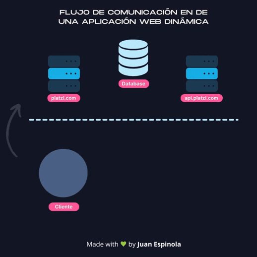
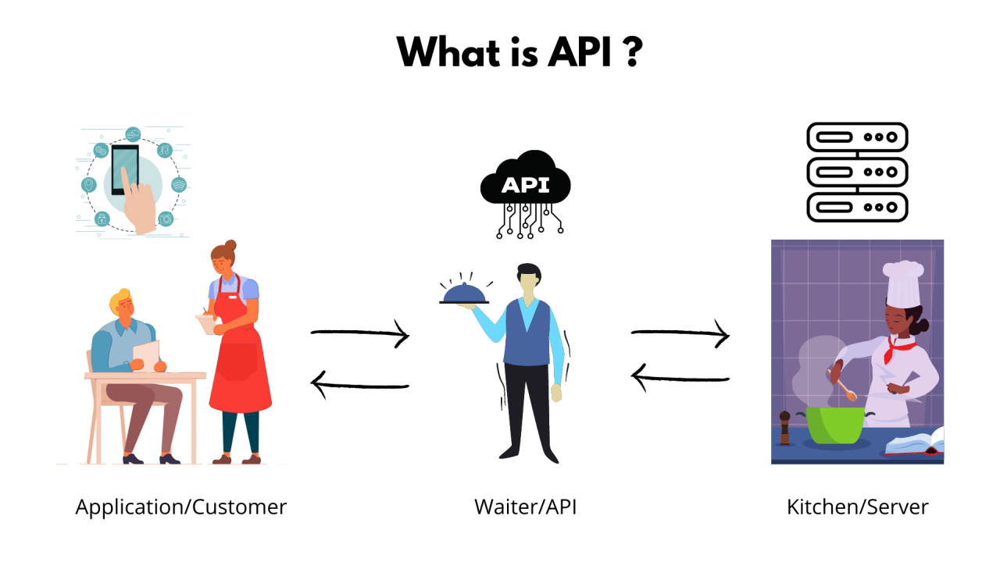
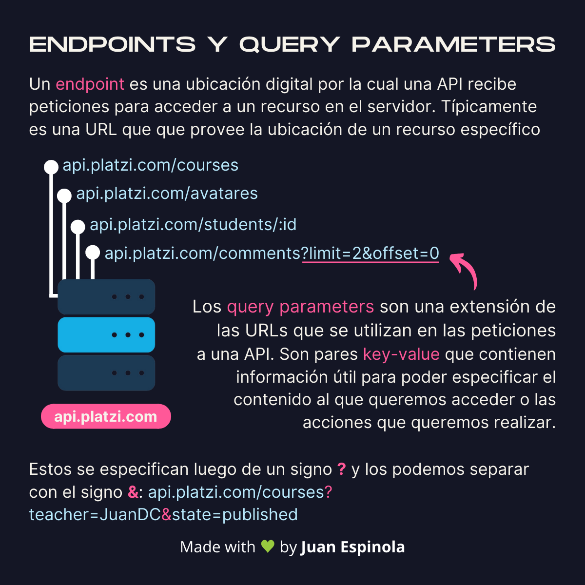
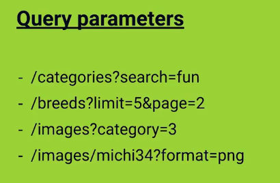
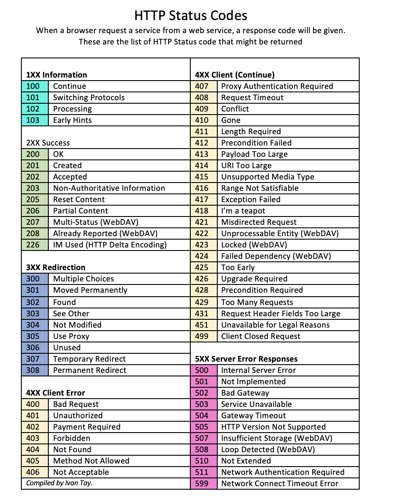
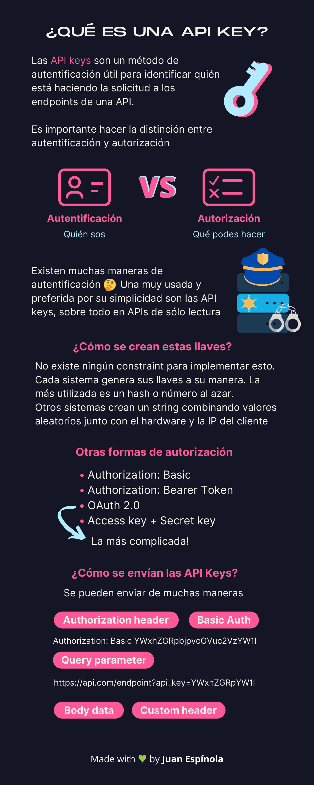
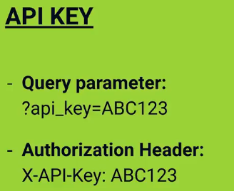
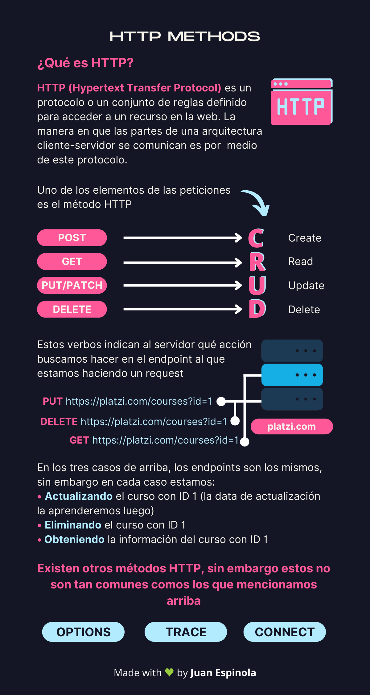

# API REST 🌐

## Conceptos clave
---

### API: Application Program Interface -> Interfaz
- Una interfaz es el medio por el cual la computadora se conecta con los humanos. Es lo visible para el usuario que interactúe con una app, por ejemplo.

### API REST
- Es el medio por el cual se comunican computadoras con otras computadoras. O también podemos pensarlo como robots con robots 🤖🔁🤖. Puede ser backend con frontend, backend con backend, etc.

### REST: Representational State Transfer
- A diferencia de una página web, que se muestra con imágenes, textos formateados, etc.; la llamada de una API REST se devuelve en un archivo JSON.

- Aunque pocas, algunas aplicaciones todavía usan el método SOAP para mandar información entre computadoras. Sin embargo, actualmente REST está dominando su aplicación.

## Flujo de comunicación entre usuarios, frontend y backend

### ¿Cómo las hacemos dinámicas y interactivas? 
- Pues las APIs del DOM que nos permiten escuchar las interacciones del usuario y la API Fetch son herramientas poderosísimas que combinadas nos dan una alternativa al tener que recargar toda la página HTML cada vez que queremos algún recurso SSR(server side rendering).

---

## Consumir una API REST

https://github.com/public-apis/public-apis

---

## Endopoints y Query parameters

---

## Http Status code

---

## Api Key

---

## Http Methods

