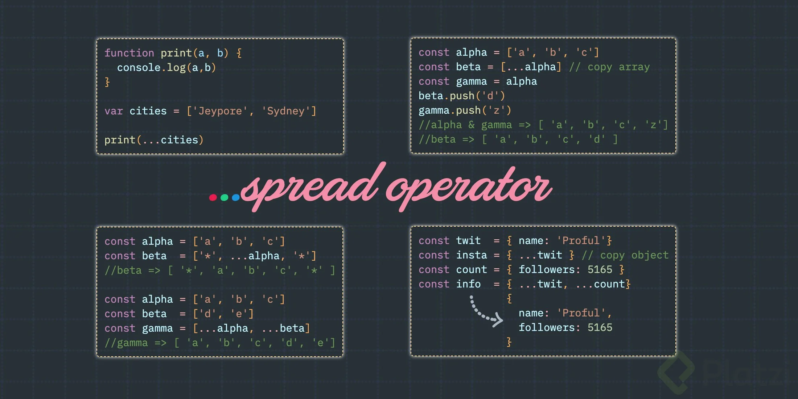
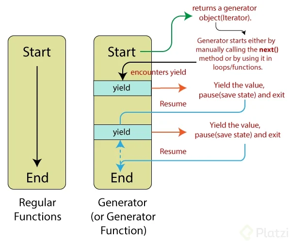
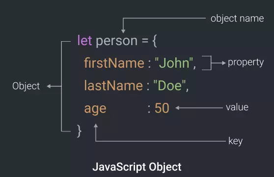
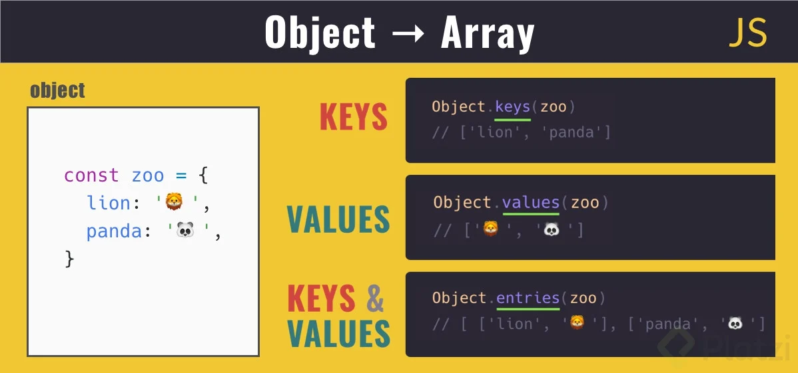

# Historia

1950 Inicio de las computadoras

1969 Se creo la red ARPANET,

1970-1990 Se explora ARPANET

1990 Tim Berners.lee dio pauta al internet y se conocio el termino World Wide Web (forma de acceder a archivos, documentos enlaces al alcanze de todos)

1993 Nacimiento de un Navegador.

Universitarios pioneros escribieron un sofware simple que inicio una revolucion.

Marc Andreessen: le dio vida a una gran empresa

Netscape: Tenia un navegador que podias acceder a internet (HTML simple, enlaces, algunas fotografias)

Browser wars: Guerra de los navegadores
Microsoft en 1995 lanzó Internet Explorer, en la guerra nacieron tecnologias como CSS, conceptos como la empresa mozilla y JS.
JS: Apareció en 4 de diciembre de 1995 Diseñado por Netscape Communications, Fundación Mozilla.

Su primer nombre fue Mocha

Luego LiveScript

Finalmente JavaScript.

Microsoft no se podia quedar atras y lanzo JScript y por eso tenermos ECMAScript (1997) permitio un estandar (serie de reglas que va a tener los lenguajes de programacion).

# Evolucion de ECMAScript:


## Que es el TC39

Es un grupo de hackers, academicos y/o personas afines a la tecnologia que se encargan de las actualizaciones, bajo el mando de ECMA.
ESNext es un nombre que siempre indica la próxima versión de javascript y esto consta de los siguientes pasos:

Stage0: Strawperson (borrador, cualquier persona puede tener una idea para implementar en el estandar)

Stage1: Proposal (propuesta formal)

Stage2: Draft (borrador, como va a funcionar la implementacion el impacto entre otros)

Stage3: Candidate (se elige el candidato, vamos a tener una propuesta que va ayudar a mejorar el lenguaje.)

Stage4: Finished (va a ser desplegada en la version normalmente en JUNIO)

# Versiones: 

## ES6:

### let y const, y arrow functions

### parámetros por defecto

### Destructuring

* Asignación de Desestructuración
la Desestructuración permite desarmar objetos y asignarle a cada elemento una variable distinta

#### DESESTRUCTURACIÓN DE ARRAYS
```
let frutas = ['Manzana', 'Pera'];
let [roja, verde] = frutas;
console.log(roja, verde);
```
#### DESESTRUCTURACIÓN DE OBJETOS
```
let user = { username: 'Julian', age:28 };
let { usuario , edad } = user;
console.log (usuario, edad);
```

```
let a, b, rest;
[a, b] = [10, 20];
console.log(a);
// output esperado: 10

console.log(b);
// output esperado: 20

[a, b, ...rest] = [10, 20, 30, 40, 50];

console.log(rest);
// expected output: Array [30,40,50]
```


### spread operator
```
let person = { name: "Alexa", age: 24 };
let country = "COL"

let data = { ...person, country };
console.log(data);
```



### rest
```
function sum(num, ...values) {
    console.log(values);
    console.log(num + values[0]);
    return num + values[0];
}

sum(1, 1, 2, 3)
```

### Object Literals
Una de las mejoras agregadas en ECMA 6 al trabajar con objetos es la representación de la asignación.
**Enhanced object literals**

El siguiente ejemplo muestra dos formas para expresar una asignación, la segunda, simplificada.
```
function newUser(user, age, country){ return { user:user, age: age, country: country } }
// esto es lo mismo que decir

function newUser(user, age, country){ return { user, age, country, } }
```

### Promesas


### Clases

Las clases son una mejora sintactica basada en prototipos de javascript. Su sintaxis no agrega nada nuevo al modelo de la herencia sino que emplea una sintaxis mas amigable.

### Constructor

El constructor se autoinvoca al instanciar una clase

```
class User {
  constructor() {
    console.log('New user');
  }

  gretting() {
    return 'Hola que ase'
  }
}

const david = new User(); // output: New User
```

### this

this hace referencia al elemento padre que lo contiene

https://sciter.com/anatomy-of-object-class-relationship-in-javascript/

### Modulos

Solo funciona esto si tenemos node.js instalado del caso contrario podemos usar require()
Recuerden que existen dos tipos de exports/imports
Default se usa cuando solo devuelves un elemento y no quieres restringir el nombre.
Export const restringe el nombre y ademas te permite devolver multiples funciones o constantes
Recuerda poner las extensiones como buena practica

### Generadores




#### Extra for of for in

Si no entendiste ese ciclo for dejame explicarte. Ese bucle for valor of iterable recorre iterables, como arrays, Map o Set. El valor es cada elemento del iterable puede tener cualquier nombre, por eso se inicia con let nombre.

```
const array = [5, 4, 3, 2, 1]

for (let numero of array) {
  console.log(numero) // 5 4 3 2 1
}
```
Sin embargo, debes tener en cuenta que solo podrás acceder a sus valores, y no a sus referencias, por lo que si quieres cambiar los elementos del array, necesitarás un índice array[indice].

```
for (let numero of array) {
  valor *= 2 
  console.log(numero) // 10 8 6 4 2
}
 
console.log(array) // [ 5, 4, 3, 2, 1 ]
```

Si intentas recorrer un objeto de esta forma for elemento of objeto, te ocurrirá un error, porque un objeto no es un iterable. En su lugar puedes utilizar for elemento in objeto, que recorrerá las propiedades del objeto.

```
const objeto = { a: 1, b: 2, c: 3 }

for (let elemento in objeto) {
  console.log(elemento) // 'a' 'b' 'c'
}
```

Sin embargo, si utilizas for elemento in array, no dará un error, pero el resultado no será el esperado, ya que los arrays son un tipo de objeto donde cada propiedad es el índice del valor del array o del iterable. Por lo que debes tener cuidado.

```
const array = [5, 4, 3, 2, 1]

for (let elemento in array) {
  console.log(elemento) // '0' '1' '2' '3' '4'
}

/* const array = {
	'0': 5,
  '1': 4,
  '2': 3,
  '3': 2,
  '4': 1
}*/

```


## ES7

### Exponentiation operator y array includes

#### Asignación de potencia
🎈 También puedes utilizar el operador de potencia para volver a asignar un valor a una variable.
```
let a = 3

a = a ** 2 // 9
// lo mismo que
a **= 2 // 9
```
#### Includes

```
let numbers = [1, 3, 4, 6, 7, 8];
console.log(numbers.includes(9))


const list = ["oscar", "David", "Ana"]
console.log(list.includes("oscar"))
console.log(list.includes("Oscar"))
```

* Includes, pero en objetos

🔗 En objetos también existen formas para saber si existe una propiedad. Estos son:

La palabra reservada **in**
El método de objetos **hasOwnProperty**
El método **Object.hasOwn**, que recibe el objeto y la propiedad a evaluar.
const letras = { a: 1, b: 2, c: 3 }

"a" in letras // true
letras.hasOwnProperty("a") // true
Object.hasOwn(letras, "a") // true

Se diferencian en que **in** evalúa todas las propiedades del objeto y del prototipo.

El método **hasOwnProperty** evalúa solamente las propiedades del objeto. Sin embargo puede que colisione con alguna otra propiedad en el prototipo, por lo que la última versión de ECMAScript lanzó **Object.hasOwn** y se recomienda utilizar este si el navegador en el que trabajas lo soporta: Can I use?.

```
const letras = { a: 1, b: 2, c: 3 }

"toString" in letras // true
letras.hasOwnProperty("toString") // false
Object.hasOwn(letras, "toString") // false
```

## ES8

### object entries y object values





### string padding y trailing commas

### funciones asíncronas

Este tipo de funciones se suelen utilizar mucho sobre todo para hacer peticiones a servidores, dado que al no ser instantaneo es necesario crear un hilo, o nuevo proceso de ejecución.
De esta manera no se interrumpe el flujo de ejecución principal de tu aplicación y tu aplicación sigue funcionando mientras llega esa respuesta del servidor.

## ES9

### Expresiones regulares

### Spread Update

Cuidado con la copia en diferentes niveles de profundidad
El operador de propagación sirve para crear una copia en un solo nivel de profundidad, esto quiere decir que si existen objetos o arrays dentro de un objeto a copiar. Entonces los sub-elementos en cada nivel, tendrán la misma referencia en la copia y en el original.
```
const original = { datos: [1, [2, 3], 4, 5] }
const copia = { ...original }

original === copia // false
original["datos"] === copia["datos"] // true
```
La manera de solucionar esto es más compleja, tendrías que utilizar el operador de propagación para cada elemento en cada nivel de profundidad.

Sin embargo, recientemente salió una forma de crear una copia profunda con StructuredClone. Aunque es una característica muy reciente, así que revisa que navegadores tienen soporte.
```
const original = { datos: [1, [2, 3], 4, 5] }
const copia = structuredClone(original)

original === copia // false
original["datos"] === copia["datos"] // false
```
### Promise.finally


## ES10

### flat, flatMap y trimStart-trimEnd

### try catch y fromEntries

## ES11

### optional chaining

### BigInt 

📏 JavaScript tiene límites numéricos, un máximo Number.MAX_SAFE_INTEGER y un mínimo Number.MIN_SAFE_INTEGER. Fuera de estos límites, los cálculos matemáticos pueden fallar y mostrar resultados erróneos. Con BigInt esto se resuelve.

### Nullish

#### Diferencia entre el operador OR y el Nullish coalescing
🔨 El operador OR (||) evalúa un valor falsey. Un valor falsy es aquel que es falso en un contexto booleano, estos son: 0, "" (string vacío), false, NaN, undefined o null.
.
Puede que recibas una variable con un valor falsy que necesites asignarle a otra variable, que no sea null o undefined. Si evalúas con el operador OR, este lo cambiará, provocando un resultado erróneo.

```
const id = 0

const orId = id || "Sin id"
const nullishId = id ?? "Sin id"

console.log( orId ) //  'Sin id'
console.log( nullishId )  // 0
```

### Promise.allSettled

Permite saber cuando todas las promesas han terminado independientemente de si han sido rechazadas o no.

Tambien existe

* Promise.all()

El método Promise.all(iterable) devuelve una promesa que termina correctamente cuando todas las promesas en el argumento iterable han sido concluídas con éxito, o bien rechaza la petición con el motivo pasado por la primera promesa que es rechazada.

* La diferencia con

Promise.allSettled()

Ejecuta todas las promesas sin importar si son rechazadas o no.

### globalThis

### matchAll

### dynamic Import

## ES12

### numeric-separators

### replaceAll

### Promise.any

Promise.any va a capturar la respuesta de la primera que sea de forma satisfactoria.
Si es reject la ignora y devuelve el primer resolve.

### metodos privados

Agregando # los métodos se vuelven privados y solo pueden ser accedidos dentro de la misma clase.

## ES13

### at

El método at() recibe un valor numérico entero y devuelve el elemento en esa posición, permitiendo valores positivos y negativos. Los valores negativos contarán desde el último elemento del array.

Esto no sugiere que haya algo mal con usar la notación de corchetes. Por ejemplo, array[0] devolvería el primer elemento. Sin embargo, en lugar de usar array.length para los últimos elementos

### top level away 


1. ¿Cuál es el comando para inicializar nuestro proyecto con Node.js?
    
    ### npm init
    
2. ¿Una variable asignada con "let" solo está disponible dentro del scope donde es definida?
    
    ### TRUE
    
3. Las Arrows Functions fueron incorporadas en:
    
    ### ES6
    
4. ¿Cuál es la forma correcta de reasignar una variable?
    
    ### Ninguna de las anteriores.
    
5. ¿Cuál es la forma propuesta en ES6 para hacer multilínea?
    
    ### let lorem2 = `Qui consequatur. so si irure but. `;
    
6. Default Params se implementó en:
    
    ### ES6
    
7. Identifica la "Promesa" entre los siguientes bloques de código:
    
    ```jsx
    **const** helloPromise = () => { 
    	**return** **new** Promise((resolve, reject) => { 
    		**if** (**true**) { 
    			resolve('Hey!'); 
    		} **else** { 
    			reject('Whooops!'); 
    		} 
    	}); 
    };
    ```
    
8. ¿Cuál es la forma correcta de exportar un módulo en ES6?
    
    ### export default functionName;
    
9. En un generator, utilizamos “next” para:
    
    ### Retornar el siguiente valor.
    
10. string.includes(value) fue implementado en:
    
    ### ES7
    
11. ¿Qué representa el siguiente código?
    
    `let result = base ** exponent;`
    
    ### Operador de Exponenciación.
    
12. ¿En qué versión de ECMAScript se implementaron las "Trailing commas"?
    
    ### ES8
    
13. ¿En qué versión de ECMAScript fueron implementadas las Async functions?
    
    ### ES8
    
14. Identifica el código que implementa "Optional Catch Binding":
    
    ```jsx
    **try** { 
    	// some code 
    } **catch** { 
    	// error handling code 
    }
    ```
    
15. ¿En que versión de ECMAScript se implementó "trimStart"?
    
    ### ES10
    
16. ¿Cuál es la forma en que ECMAScript 11 en 2020 permitió realizar la importación dinámica?
    
    ### Usando async y await para realizar la importación dentro de la llamada al evento
    
17. ¿Cuál es la forma correcta de trabajar con números mayores que 2^53 gracias a la característica de BigInt que trajo ECMAScript 11?
    
    ### Usando el objeto BigInt pasando el número como parámetro
    
18. Cual de las siguientes NO es una característica sobre las nuevas funcionalidades de ECMAScript en 2021:
    
    ### `??=` asignación de anulación lógica

