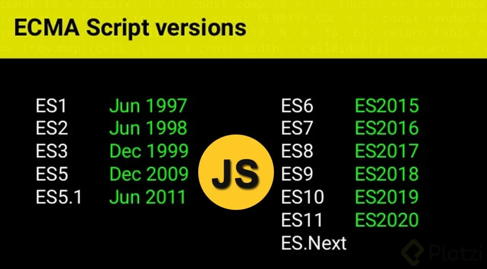
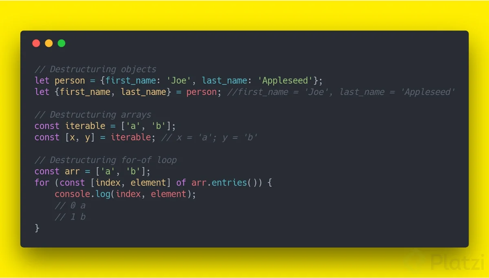

# Historia

1950 Inicio de las computadoras

1969 Se creo la red ARPANET,

1970-1990 Se explora ARPANET

1990 Tim Berners.lee dio pauta al internet y se conocio el termino World Wide Web (forma de acceder a archivos, documentos enlaces al alcanze de todos)

1993 Nacimiento de un Navegador.

Universitarios pioneros escribieron un sofware simple que inicio una revolucion.

Marc Andreessen: le dio vida a una gran empresa

Netscape: Tenia un navegador que podias acceder a internet (HTML simple, enlaces, algunas fotografias)

Browser wars: Guerra de los navegadores
Microsoft en 1995 lanzó Internet Explorer, en la guerra nacieron tecnologias como CSS, conceptos como la empresa mozilla y JS.
JS: Apareció en 4 de diciembre de 1995 Diseñado por Netscape Communications, Fundación Mozilla.

Su primer nombre fue Mocha

Luego LiveScript

Finalmente JavaScript.

Microsoft no se podia quedar atras y lanzo JScript y por eso tenermos ECMAScript (1997) permitio un estandar (serie de reglas que va a tener los lenguajes de programacion).

# Evolucion de ECMAScript:



## Que es el TC39

Es un grupo de hackers, academicos y/o personas afines a la tecnologia que se encargan de las actualizaciones, bajo el mando de ECMA.
ESNext es un nombre que siempre indica la próxima versión de javascript y esto consta de los siguientes pasos:

Stage0: Strawperson (borrador, cualquier persona puede tener una idea para implementar en el estandar)

Stage1: Proposal (propuesta formal)

Stage2: Draft (borrador, como va a funcionar la implementacion el impacto entre otros)

Stage3: Candidate (se elige el candidato, vamos a tener una propuesta que va ayudar a mejorar el lenguaje.)

Stage4: Finished (va a ser desplegada en la version normalmente en JUNIO)

# Versiones: 

## ES6:

* let y const, y arrow functions

* parámetros por defecto

* desestructuración


* spread operator
```
let person = { name: "Alexa", age: 24 };
let country = "COL"

let data = { ...person, country };
console.log(data);
```

* rest
```
function sum(num, ...values) {
    console.log(values);
    console.log(num + values[0]);
    return num + values[0];
}

sum(1, 1, 2, 3)
```

* object literals
