## Historia de JavaScript

Con el nacimiento de las tecnologías web (HTTP, HTML y navegadores primitivos), las páginas web eran muy básicas y estáticas: solo se podía consumir texto e imágenes.

De hecho, los usuarios del navegador NetScape solicitaban mejoraras y actualizaciones del software por la necesidad de evolucionar las páginas web.

JavaScript fue creado por **Brendan Eich**, inspirado por otros lenguajes como Java, Scheme y Self. El propósito de JavaScript fue dar solución a la problemática de las páginas estáticas.

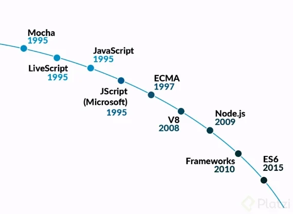

### Origen de JavaScript

El primer lenguaje generado fue **Mocha**, construido por Brendan Eich en 1995. Este permitía una pequeña interactividad en las páginas para el navegador Netscape. Sin embargo, debido a que su desarrollo fue muy rápido, tuvo que evolucionar, y ese mismo año se produjo LiveScript.

**LiveScript** era una mejora de Mocha que ofrecía algunas características de interactividad más avanzadas. A finales del mismo año, se originó una nueva versión del lenguaje, llamada **JavaScript**.

El nombre de JavaScript fue puramente comercial, debido a que el lenguaje más popular de la época era **Java**. Por lo que querían relacionarlo con este para que creciera su popularidad. Sin embargo, *JavaScript y Java son dos lenguajes totalmente diferentes*.

### JavaScript como estándar de la web

A medida que JavaScript obtuvo más popularidad, surgieron variaciones de este lenguaje. En 1995, la empresa Microsoft decidió hacer su variación del lenguaje para utilizarlo en su navegador Internet Explorer.

Debido a que surgían nuevas versiones del lenguaje, y para evitar que cada navegador tuviera una versión diferente, la organización ECMA International (que en ese momento surgió como un comité) decidió que los navegadores emplearían un estándar del lenguaje JavaScript.

Esta organización se encarga de añadir nuevas características, el lenguaje que permitan la evolución de JavaScript.

### Motor Engine V8

En el año 2008, surgió el motor de JavaScript creado por Google. Este corre en el navegador, con el nombre **V8 JavaScript Engine**, y fue un desarrollo importante en la historia de JavaScript, ya que resolvió la **problemática de los tiempos de interpretación**.

La razón detrás de esta mejora tan grande radica principalmente en la **combinación de intérprete y compilador**. Hoy en día, los cuatro motores de búsqueda usan esta técnica: 
* El intérprete ejecuta el código fuente casi de inmediato
* El compilador traduce el código fuente en código máquina para que el sistema del usuario se ejecute de manera directa.

### Node.js, JavaScript del lado del servidor

**Node.js** es la forma como podemos utilizar JavaScript de parte del servidor o en el backend, esto debido a que utiliza el motor Engine de JavaScript V8.

### Mejoras a JavaScript

Un **framework** es un conjunto de herramientas y funcionalidades para resolver un problema de software. Para JavaScript, los frameworks permiten construir páginas web de manera rápida y optimizada.

En el 2010 empiezan a surgir los primeros frameworks de JavaScript.

La organización encargada de los estándares, ECMA International, decidió modernizar el lenguaje con mejoras que permitieran trabajar más rápido y óptimo con JavaScript.

En el 2015 se publicó **ECMAScript 6** o ECMAScript 2015 que recopiló nuevas características del lenguaje y se publicó como una nueva versión de JavaScript.

Cada año, una nueva versión de JavaScript es publicada con el nombre de ECMAScript 7, 8, 9, y así sucesivamente. Esto significa que existirán nuevas características como estándar en el lenguaje que cada navegador implementará.

---

## ¿Cómo funciona el JavaScript Engine?

Cuando se escribe código en JavaScript, es necesario transformarlo en código que entienda el computador, este código es denominado Machine Code o código de máquina. El motor del navegador es el encargado de crear Machine Code a partir de instrucciones escritas en JavaScript.

Cada navegador tiene su propio motor, sin embargo, el que más impacto ha tenido sobre el lenguaje, es Engine V8 desarrollado por Google y que lo encuentras en navegadores como Google Chrome y Microsoft Edge. Engine V8 también es el motor utilizado por Node.js para trabajar con JavaScript del lado del servidor.

Qué es y cómo funciona JIT compiler
El proceso en el que el motor V8 transforma código JavaScript en Machine Code se denomina Just in Time Compiler o JIT compiler.

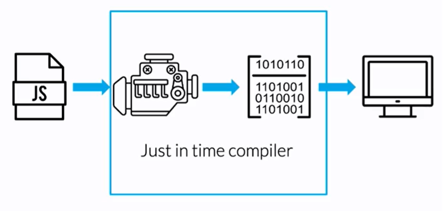

---

## V8, el JavaScript Engine de Chrome

V8 es un motor de código abierto para JavaScript creado por Google. Cada navegador tiene su propio motor, pero con la evolución rápida de V8, otros navegadores han optado por integrarlo. Por este motivo, Microsoft Edge u Opera han decidido migrar a V8 para mejorar el rendimiento de su software.

### ¿Cuál es el objetivo de V8?

Este fue creado por la necesidad de Google de desarrollar su aplicación Google Maps de la manera más óptima posible, ya que los motores antiguos no permitían ejecutar aplicaciones con alta demanda computacional. Node.js utiliza el motor V8 para trabajar con JavaScript del lado del servidor de manera estable.

https://en.wikipedia.org/wiki/List_of_ECMAScript_engines

---

## Profundizando en el Engine

Una vez que se ejecuta un archivo en el navegador, el motor de JavaScript genera un entorno global (Global environment). El entorno global hace tres cosas muy importantes:

Genera un objeto global llamado window.
Genera un contexto llamado this. En un contexto global this es igual a window.
Ambiente de ejecución.
Después de generar el entorno global, comienza el contexto de ejecución (Execution context) donde corre el código de JavaScript utilizando un Stack de tareas, apilándolas una por una, en la cuál la última tarea añadida será la primera en ejecutarse.

Una vez que el motor de JavaScript está interactuando con el navegador, realiza los siguientes procesos:

Parser: genera un parseo del documento completo mediante palabras claves.

AST: Se crea a partir de los nodos que genera el parser. Es una estructura de árbol que representa tu código sintácticamente. Puedes utilizar la página AST Explorer{target="_blank"} para ver cómo funciona.

Intérprete: El intérprete recorre el AST y genera Bytecode (lenguaje que entiende la computadora y no es binario) basado en la información que contiene. Sin embargo, si el intérprete detecta que puede optimizar tu código, no genera Bytecode, sino que genera un proceso de optimización que consiste en el profiler y compiler.

Profiler y compiler: El profiler monitorea y mira el código para optimizarlo. El compiler optimiza ese código y genera machine code (lenguaje binario). En esta etapa, por la intención de optimizar el código, también genera errores como el Hoisting.

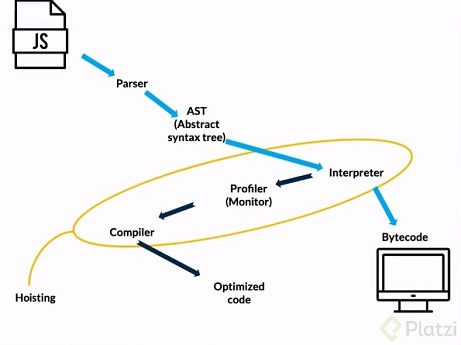

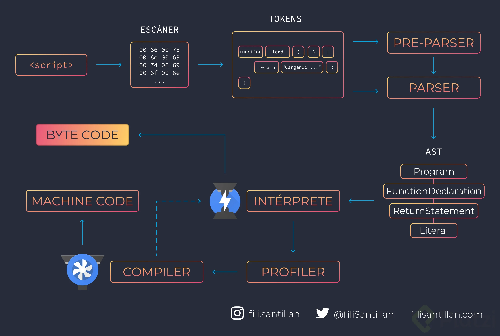


Si abres la consola del navegador, con la combinación de teclas Ctrl + Shift + I o clic derecho e “Inspeccionar” en tu navegador preferido (de preferencia Google Chrome).

Ejecuta la palabra window, se desplegará un objeto en el que se encuentran todas las funcionalidades de JavaScript, por ejemplo ejecuta window.console.log("Hola") tendrá el mismo comportamiento que console.log("Hola").

Si ejecutas this observarás que muestra el mismo objeto que window, esto es porque en un contexto global, estos dos objetos son iguales. Pero en otros contextos, como el de una función o una clase, this cambia.

Qué es hoisting
Hoisting es un término para describir que las declaraciones de variables y funciones son movidas a la parte superior del scope más cercano: scope global o de función. Esto sucede solamente con las declaraciones y no con las asignaciones.

El código permanece igual, solo es una interpretación del motor de JavaScript que intenta ayudar a optimizar el código, pero en este caso provoca errores y resultados no esperados. En el caso de las variables solo sucede cuando son declaradas con var.

Hoisting en variables declaradas con var

En el siguiente código, la respuesta del console.log es undefined, porque al hacer referencia a una variable que no está declarada, el motor de JavaScript crea esta variable antes de la declaración y le asigna un valor de undefined.

```
console.log(nombre) // undefined
var nombre = "Andres"
```

```
var nombre = undefined
console.log(nombre)
nombre = "Andres"
```

Lo adecuado es evitar utilizar var para declarar las variables con let o const, ya que estas últimas el proceso de optimización que realiza el motor de JavaScript no generará variables con el valor de undefined antes de su declaración.

## Memory Heap

El comportamiento de JavaScript es síncrono, es decir, solamente puede ejecutar una tarea a la vez. Esto puede ser beneficio o perjudicial dependiendo los casos. Por ende, para ejecutar cada tarea, JavaScript se organiza en dos estructuras de datos: el Memory Heap y el Call Stack.

### Qué es Memory Heap?

El memory heap consiste en una manera desorganizada o aleatoria de guardar la información, ya sea valores, funciones, entre otros. ¿Recuerdas el componente de tu computador que guarda información de manera aleatoria? Exactamente, la RAM es donde guardará esta información mediante una referencia o dirección.

* Memoria y cómo se guardan los datos

Por ejemplo, declaras una variable nombre y le asignas un valor, esta se guardará en la memoria RAM utilizando una referencia que manejará el memory heap. De esta manera, el Engine sabrá que variable mostrar cuando sea utilizada después de la declaración, pidiendo la referencia de memoria al memory heap y buscándola en la memoria RAM.


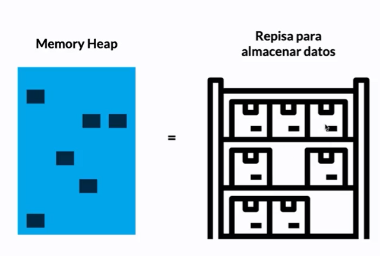

### Valores por referencia

¿Qué pasa con estructuras más complejas, como arrays u objetos? Pues que estas se guardarán en una dirección de memoria diferente a sus valores, pero referenciadas entre sí. Por ejemplo, mira el siguiente código y piensa cuál es el resultado:

```
const objeto1 = {valor: 1}
const objeto2 = objeto1
objeto2.valor = 2

console.log(objeto1.valor)
console.log(objeto1 === objeto2)
```

Primero mostrará el valor 2 y después true. La explicación es que la referencia de ambos objetos a sus valores es la misma, por lo que si modificas un valor, también lo harás en ambos.

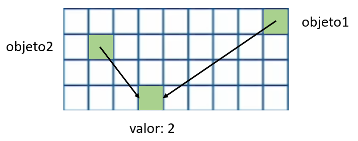


## Call Stack

El *Call Stack* consiste en ordenar las funciones que son invocadas de arriba hacia abajo, donde la última tarea será la que se ejecute primero. Una vez se ha guardado la información del archivo o programa, es momento de ejecutarlas.

Primeramente, guarda todas las funciones o declaraciones en anonymous que representa el objeto global.

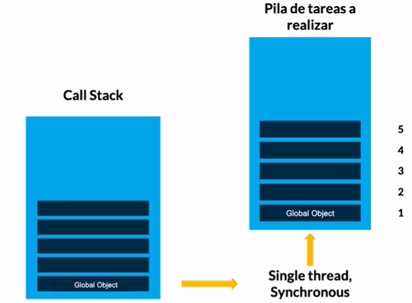

Y así sucesivamente. Va agregando y quitando ejecuciones en el orden correspondiente. Es por eso que JavaScript realiza una tarea a la vez.

### Ejemplo de ejecución:

El siguiente código contiene tres funciones **hello**, **world** y **main** que ya han sido guardadas en el memory heap al declararlas y están listas para ejecutarse.

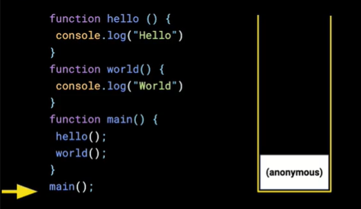

Al llegar a la función **main**, el Engine lo coloca en el *Call Stack* para ejecutarlo. Pero dentro se encuentran más invocaciones a otras funciones, por ende, primero ejecutará la que esté más arriba hasta ejecutarlas todas.

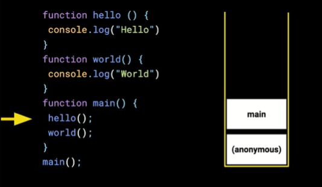

Al invocar la función **hello**, el Engine lo coloca en el *Call Stack*. La función **console.log** también es una función, por lo que el Engine también lo colocará en el *Call Stack*.

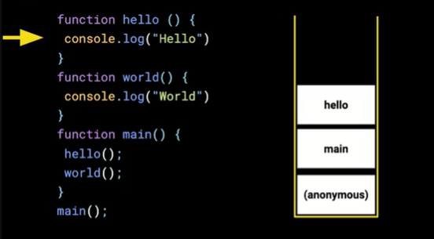

Una vez ejecutada la función **console.log** el Engine lo sacará del *Call Stack*.

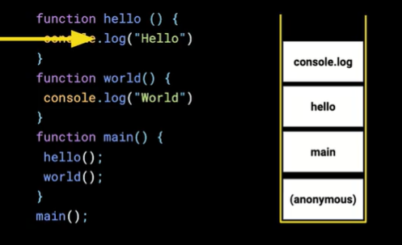

Como la función **hello** ya ha sido ejecutada, el Engine lo sacará del *Call Stack* para seguir ejecutando la función **main**.

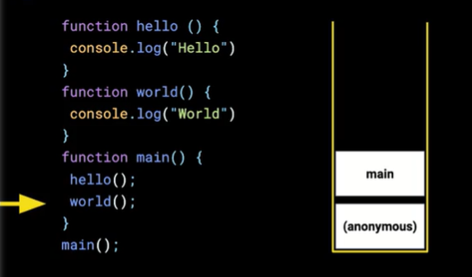

Y así sucesivamente, hasta que termine de ejecutarse **main**, o todas las tareas en el *Call Stack*. Cuando no existan tareas en el *Call Stack*, el programa habrá finalizado.

## Garbage Collection

Garbage Collection es un proceso automático realizado por el motor de JavaScript que consiste en eliminar aquellos objetos que no tienen referencias o son inalcanzables para el contexto de ejecución, a través del algoritmo mark-and-sweep (marcado y barrido).

En simples palabras, limpia la memoria de los datos no utilizados para no sobrecargarla y seguir trabajando sin problemas.

El Garbage Collection es importante para liberar aquellas referencias en memoria y no exista un desbordamiento en las tareas (Stack overflow). Por ejemplo, un ciclo infinito que provoque el colapso de la página web.

### Algoritmo marcado y barrido

El algoritmo marcado y barrido (mark-and-sweep) hace referencia a cuando un tipo de dato se vuelve inalcanzable para el programa. El motor de JavaScript empieza por la raíz, la cual es el Objeto Global, a medida que el programa avanza los objetos van creando o borrando referencias a sus raíces.

Cuando un objeto se queda ninguna referencia, se dice que el objeto es inalcanzable, en este momento el Garbage Collection libera el espacio que usaban las variables u objetos cuando aún tenían una referencia.

Desde 2012, los navegadores utilizan un Garbage Collection, que ha ido recibiendo mejoras en su implementación constantemente.

### Ejemplo que actúa el Garbage Collection

En este punto de tu estudio, ya conocerás los métodos shift y pop de arrays, puede que los hayas entendido como eliminar el primer y último elemento de un array, respectivamente.

Pues no funcionan exactamente como “eliminar”, sino como extraer el primer y último elemento, pero si no lo guardamos en una variable, el Garbage Collection lo eliminará.

```
const array = [1,2,3,4,5]
const lastElement = array.pop() 
console.log(lastElement) //5
```
* Extrae el último elemento, guarda la referencia en la variable lastElement.

```
const array = [1,2,3,4,5]
array.pop() 
console.log(array) // [1,2,3,4]
```
Por lo tanto, el que elimina ese valor, es el Garbage Collection.

## Qué es Stack overflow

Stack overflow es un término empleado para referirse al desbordamiento de tareas en el Call Stack del motor de JavaScript. Esto ocurre por ciclos infinitos, funciones recursivas sin control, cambios de estado continuo, o algún programa que exceda las tareas que puede ejecutar el navegador.

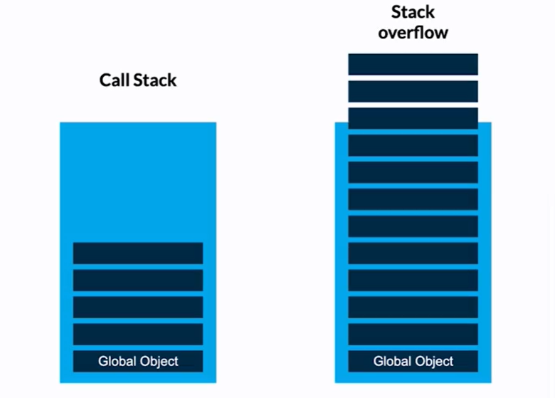

Anteriormente, los navegadores no estaban preparados para manejar un stack overflow, por lo que la página web colapsaba y cerraba la aplicación. En la actualidad, si el navegador encuentra este problema, detiene la ejecución del código evitando que colapse la página web.

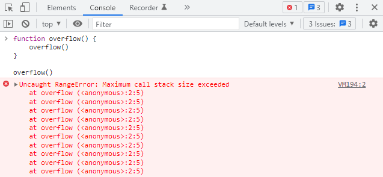

## JavaScript Runtime

Recordando el material de Call Stack, se mencionó que JavaScript realiza una tarea a la vez en el Call Stack, esto se denomina código síncrono o Single thread. La sincronía puede presentar problemas en operaciones que demoren demasiado.

### Ejemplo práctico

Por ejemplo, imagina que JavaScript es una tienda de tacos, tú trabajas ahí y solamente puedes hacer una preparación a la vez. Llegan tres personas que ordenan un taco, una torta y un taco, y tienes que atenderlos en ese orden.

El primer taco probablemente se demore 5 minutos. Luego, la preparación de la torta es más compleja, por lo que posiblemente demorará 20 minutos. En este punto, el tercer cliente se ha hartado de la espera y se retira. Este proceso no es óptimo.

```
console.log("taco")
console.log("torta")
console.log("taco")
```

En Internet sucede lo mismo, si un usuario no observa información en tu página web en los primeros cinco segundo, se retirará.

Entonces, una solución sería ejecutar las tareas más lentas (torta) después de las más rápidas (tacos). Y esta solución se llama asincronismo y JavaScript tiene una manera de manejarlo.


## Qué es la asincronía en JavaScript

La asincronía de JavaScript consiste en delegar algunas tareas para que las ejecute el navegador, una vez esas tareas están terminadas entran en otra estructura llamada Callback queue. En el Callback queue la primera tarea que entra, es la primera en salir. ¿Cómo salen? Mediante el Event Loop.

El Event loop es el encargado de preguntar al Call Stack si ya ha terminado todas sus tareas. Entonces, si y solo si el Call Stack está vacío, el Event loop moverá las funciones que están en el Callback queue para que se ejecuten.

Para entender mejor este término, eetomemos el ejemplo de los tacos, pero ahora tienes un compañero. Entonces tú delegas la tarea de preparar la torta a otra persona, mientras realizas los tacos.

Luego de 5 minutos por cada tarea, entregas las tortas a los clientes correspondientes. Después de 10 minutos necesitas la torta, entonces preguntas ¿ya está lista la torta? Tu ayudante te entrega la torta y se lo entregas. En total fueron 20 minutos y todos los clientes recibieron su pedido. Así funciona la asincronía en JavaScript.

Asincronía en JavaScript
El proceso completo que sigue JavaScript se muestra en la siguiente imagen:

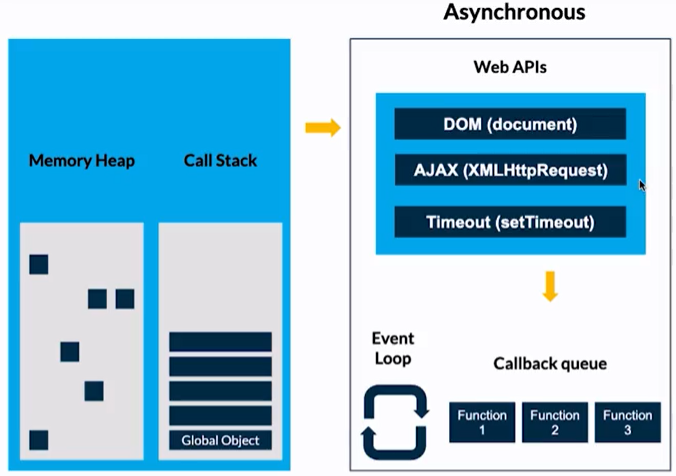

Las Web APIs son herramientas adicionales que te ofrece el navegador para realizar peticiones, modificar el DOM, entre otras. Estas herramientas las puedes observar en el objeto global window.

Ejemplo de asincronía
Rápidamente, la función asíncrona setTimeout consiste en ejecutar otra función en cierto tiempo. Recibe dos valores, la función a establecer un retraso y el tiempo en milisegundos.

Observa el siguiente código y piensa cuál será el resultado:

```
const foo = () => console.log("First");
const bar = () => setTimeout(() => console.log("Second"), 0);
const baz = () => console.log("Third");

bar();
foo();
baz();
```
El resultado es:

* Primero se muestra en consola "First".

* Segundo se muestra en consola "Third".

* Después de medio segundo, "Second".

Esto es porque la función bar salió del Call Stack para esperar asíncronamente un tiempo definido (0 segundos en este caso). 

Después tendrá que esperar (sin importar el tiempo establecido en setTimeout) hasta que se vacíe el Call Stack para que el Event loop le permita entrar nuevamente al Call Stack para ejecutarse.


.mal

¿Qué es un stack overflow?
Es cuando llenamos la memoria de tareas que podemos procesar en el call stack.

¿Qué es y qué hace un motor de JavaScript?
Es un compilador, que compila código JavaScript a código máquina.


¿Qué es el Memory Heap?
Es el lugar donde se guardan variables primitivas, objetos y funciones en bloques de memoria de forma ordenada, los cuales pueden ser usados múltiples veces a través de una referencia única.


¿Cómo se llama el algoritmo que nos ayuda a limpiar nuestra memoria cuando tenemos valores de variables que ya no estamos utilizando?
Garbage Collection