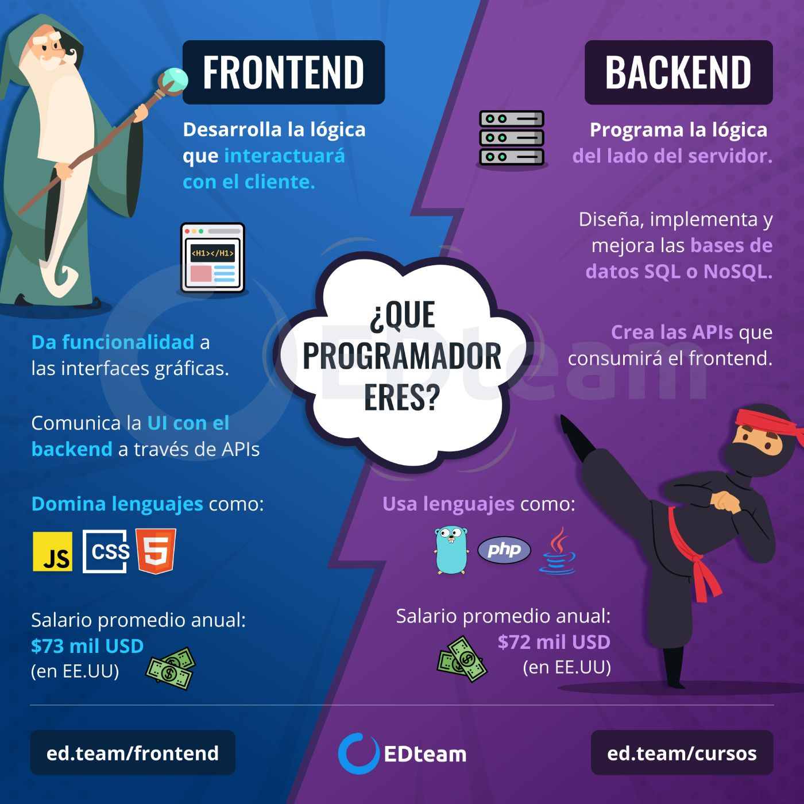
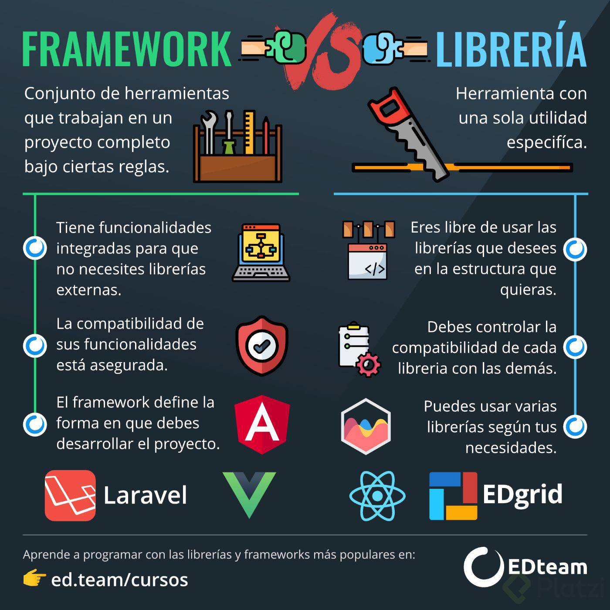
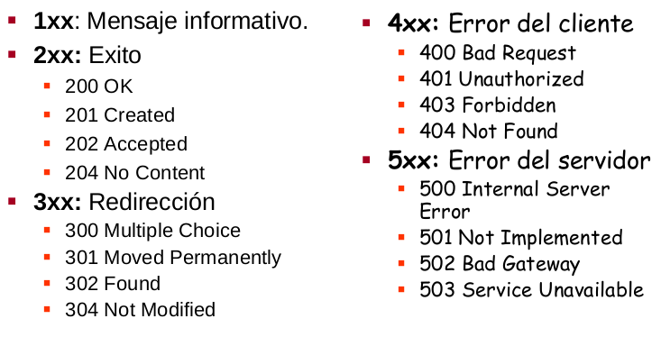
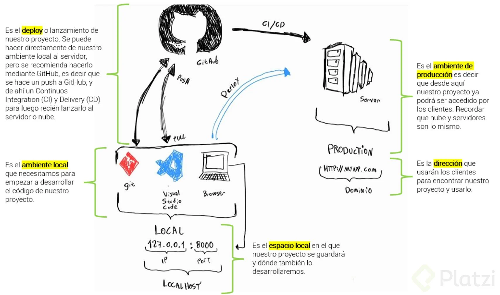
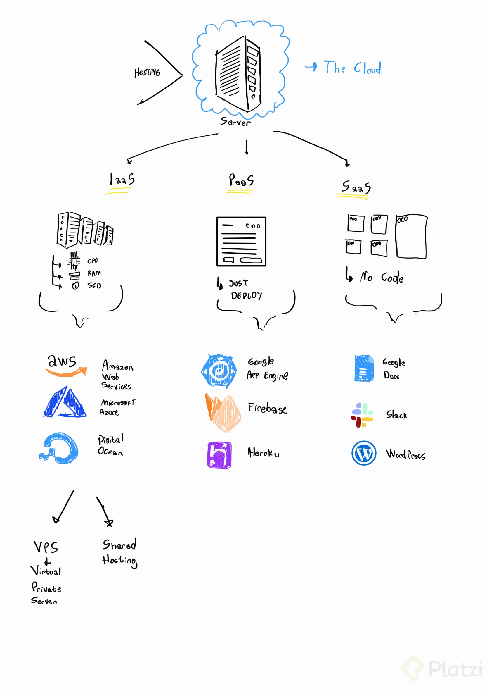
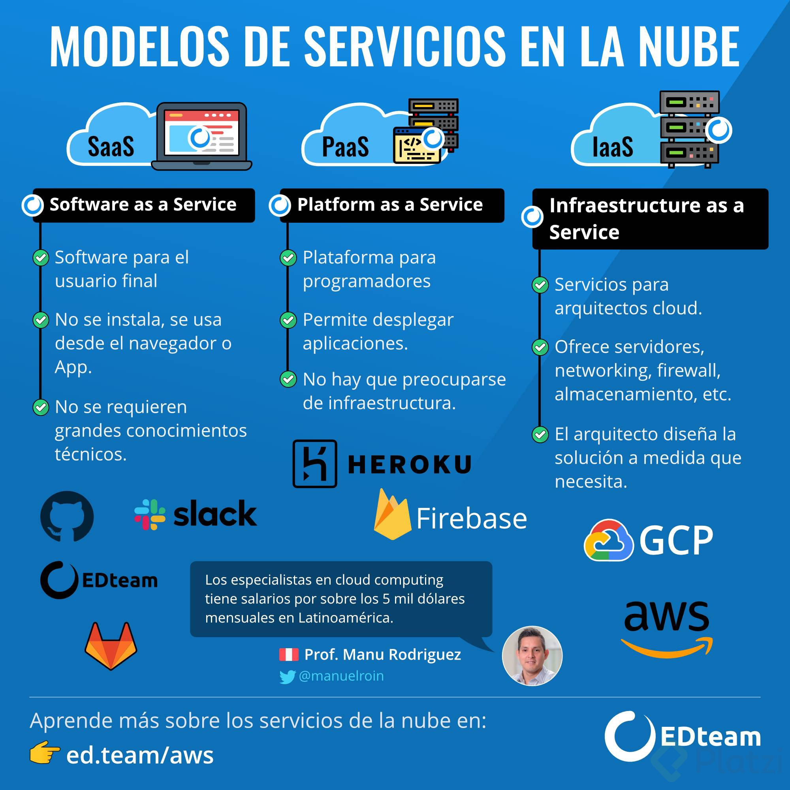
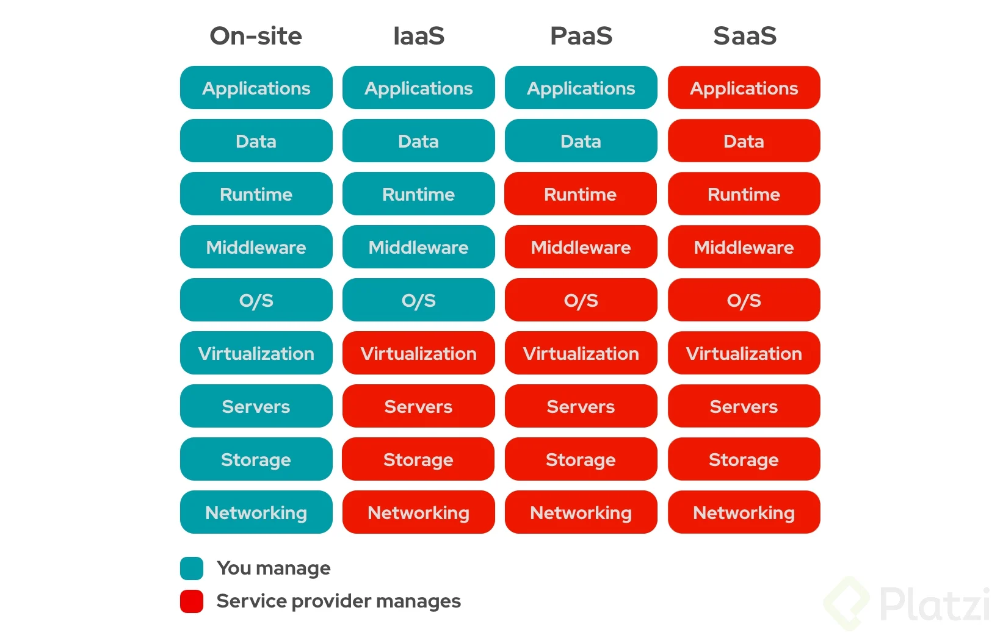

## Yin y Yang de una aplicación: frontend y backend

## Framework vs. librería

React es la libreria mas popular de desarrollo Frontend. Pero al ser una libreria, es una sola herramienta que se encarga de contruir una sola cosa… la interfaz de usuario. Debido a esto, existe un ecosistema de trabajo al rededor de React, este ecosistema son un conjunto de otras librerias que se usan para otros propositos.

Por ejemplo existen:

* Formik o React Hook Form con Yup: Para la contruccion y validacion de formularios.
* React Query
* React Router: Para trabajar con las rutas y paginacion de tu app.
* Redux: Para el manejo del estado.

En cambio Angular, es un Framework completo, todo lo que mencioné antes, Angular ya lo trae (ya trae pre-contruida una herramienta para hacer formularios, etc), ademas de reglas y lineaminetos para crear sus aplicacione web. Los aprendes y listo, los implementas.

## Cómo se conecta el frontend con el backend: API y JSON

Una API es una sección del motor, que permite que el frontend, pueda comunicarse con el backend, y que puedan haber mensajes de ida y vuelta. Ademas una API une dos piezas de software. **NO solo aplica a Backend con Frontend**.

### Existen dos maneras de comunicarse:
* SOAP: Single Object Access Protocol, usaba (y sigue usando) **XML (**Extensible Markup Language). Aquí va un ejemplo de XML:
* REST: Representational state transfer.
Vamos a tener que confiar en **JSON (**JavaScript Object Notation)

JSON también es conocido como “un diccionario de Python”, y esto es lo mismo que los “objetos de JavaScript”.

## El lenguaje que habla Internet: HTTP

## ¿Cómo es el flujo de desarrollo de una aplicación web?

## El hogar de tu código: el servidor

### El servidor
* Es una computadora que contiene una aplicación y la distribuye mediante el protocolo HTTP.

### La nube
* Son servidores juntos que se encuentan en algún lugar del mundo funcionando y distribuyendo aplicaciones. Estos se encuentran en un sitio llamado Data Centers

### Data Centers
* Son los lugares donde se encuentran los servidores, los cuales almacenan datos (como tu página web, o una aplicación como Facebook).

### Hosting
Es el acto de guardar tu aplicación en un server. Un espacio en un servidor, donde tu aplicación será guardada.

Existen diferentes tipos de hosting (formas de guardar aplicaciones):

* IaaS: Infrastructure as a Service
* PaaS: Platform as a Service
* SaaS: Software as a Service

Base de datos
Seguridad
Firewall ???
Qué es un Firewall?

Los firewall o cortafuegos en su traducción, son son programas de software o dispositivos de hardware que filtran y examinan la información que viaja a través de tu conexión a Internet. Representan la primera defensa porque pueden evitar que un programa malicioso o un atacante obtengan acceso a tu red y a tu información antes de que se produzca cualquier posible daño.

Las PaaS tienen una interfaz gráfica que te permite elegir lo que tu app necesita (como una DB o que tipo de Firewall). Creando así un nivel de abstracción donde no tienes que preocuparte de las especificaciones de los servers.

